# Advanced Programming for Systems Biology and Visualisation

#### By 1836811
#### GitHub Repo: https://github.com/DLBPointon/APSB-coursework/

### Download and process an omics dataset

First, we must download a chosen dataset. This will be taken from the paper "Snord116-dependent diurnal rhythm of DNA methylation in mouse cortex" (Coulson et al. 2018), in which the authors look to investigate duirnally rythmic methylation of DNA. In order to simplify this, this project will focus on one replicate of the wild-type experiment. The methylation time course data are downloaded below:

In order to organise our data, we create a new directory.


```python
!mkdir data
```

The following 6 files are the first replicate of wild-type mice for each tested time. 

**BEWARE** In testing these files, they completed with a 450 error, which required the files to be re-downloaded.


```python
!curl https://ftp.ncbi.nlm.nih.gov/geo/samples/GSM2758nnn/GSM2758971/suppl/GSM2758971_JLRC004B.bed.gz -o ./data/ZT00_methylation_data.bed.gz
```


```python
!curl https://ftp.ncbi.nlm.nih.gov/geo/samples/GSM2977nnn/GSM2977644/suppl/GSM2977644_JLRC007A.bed.gz -o ./data/ZT03_methylation_data.bed.gz
```


```python
!curl https://ftp.ncbi.nlm.nih.gov/geo/samples/GSM2758nnn/GSM2758974/suppl/GSM2758974_JLRC001B.bed.gz -o ./data/ZT06_methylation_data.bed.gz
```


```python
!curl https://ftp.ncbi.nlm.nih.gov/geo/samples/GSM2977nnn/GSM2977647/suppl/GSM2977647_JLRC007C.bed.gz -o ./data/ZT09_methylation_data.bed.gz
```


```python
!curl https://ftp.ncbi.nlm.nih.gov/geo/samples/GSM2758nnn/GSM2758977/suppl/GSM2758977_JLRC004D.bed.gz -o ./data/ZT12_methylation_data.bed.gz
```


```python
!curl https://ftp.ncbi.nlm.nih.gov/geo/samples/GSM2758nnn/GSM2758980/suppl/GSM2758980_JLRC001D.bed.gz -o ./data/ZT16_methylation_data.bed.gz
```


```bash
%%bash
cd data
for i in ./*gz;
    do gunzip $i
done

```

An example of the data can be seen here:


```bash
%%bash
cd data
for i in ./*bed;
    do echo $i;
    head -n 5 $i
done
```

The data are in the format of:
1. chromosome
2. start of C
3. end of C (1 base away)
4. percent methylation and number of reads contributing to the permeth call (separate by a -)
5. 0 (placeholder for bed format)
6. strand (if CpG then it says + but is really a combination of both strands)
7. 0 (placeholder for bed format)
8. 0 (placeholder for bed format)
9. color (in RRR,GGG,BBB format)

As a form of analysis and to get a good look at the data as whole we can graph this. As the graph would be rather large using the full data set, we will focus on the Y chromosome and generate a graph showing percentage likelihood of methylation per time zone.

## Exploration

Import modules for further analysis.


```python
%matplotlib inline
```


```python
import pandas as pd
```


```python
from matplotlib import pyplot as plt
```

Basic analysis on the ZT03 bed file. This df will have 18 million rows of data, this would make it very difficult to reliably plot.


```python
ZT03 = pd.read_csv('./data/ZT03_methylation_data.bed', sep='\t', header=None)
```

Add headers to the dataframe for easier navigation


```python
header = ['chrom', 'chromStart', 'chromEnd', 'percentMeth-reads', 'placeholder1', 'strand', 'placeholder2', 'placeholder3', 'RGBcode']
ZT03.columns = header[:len(ZT03.columns)]
```

I only want data pertaining to methylated sites so we can perform some filtering on column 4, which requires being split from read count


```python
ZT03[['percentMeth', 'MethReads']] = ZT03['percentMeth-reads'].str.split('-', 1, expand=True)
```


```python
ZT03
```


<div>
<style scoped>
    .dataframe tbody tr th:only-of-type {
        vertical-align: middle;
    }

    .dataframe tbody tr th {
        vertical-align: top;
    }

    .dataframe thead th {
        text-align: right;
    }
</style>
<table border="1" class="dataframe">
  <thead>
    <tr style="text-align: right;">
      <th></th>
      <th>chrom</th>
      <th>chromStart</th>
      <th>chromEnd</th>
      <th>percentMeth-reads</th>
      <th>placeholder1</th>
      <th>strand</th>
      <th>placeholder2</th>
      <th>placeholder3</th>
      <th>RGBcode</th>
      <th>percentMeth</th>
      <th>MethReads</th>
    </tr>
  </thead>
  <tbody>
    <tr>
      <th>0</th>
      <td>chr1</td>
      <td>3000827</td>
      <td>3000828</td>
      <td>1.00-1</td>
      <td>0</td>
      <td>+</td>
      <td>0</td>
      <td>0</td>
      <td>210,27,27</td>
      <td>1.00</td>
      <td>1</td>
    </tr>
    <tr>
      <th>1</th>
      <td>chr1</td>
      <td>3001007</td>
      <td>3001008</td>
      <td>1.00-3</td>
      <td>0</td>
      <td>+</td>
      <td>0</td>
      <td>0</td>
      <td>210,27,27</td>
      <td>1.00</td>
      <td>3</td>
    </tr>
    <tr>
      <th>2</th>
      <td>chr1</td>
      <td>3001277</td>
      <td>3001278</td>
      <td>1.00-1</td>
      <td>0</td>
      <td>+</td>
      <td>0</td>
      <td>0</td>
      <td>210,27,27</td>
      <td>1.00</td>
      <td>1</td>
    </tr>
    <tr>
      <th>3</th>
      <td>chr1</td>
      <td>3001629</td>
      <td>3001630</td>
      <td>1.00-2</td>
      <td>0</td>
      <td>+</td>
      <td>0</td>
      <td>0</td>
      <td>210,27,27</td>
      <td>1.00</td>
      <td>2</td>
    </tr>
    <tr>
      <th>4</th>
      <td>chr1</td>
      <td>3003226</td>
      <td>3003227</td>
      <td>1.00-2</td>
      <td>0</td>
      <td>+</td>
      <td>0</td>
      <td>0</td>
      <td>210,27,27</td>
      <td>1.00</td>
      <td>2</td>
    </tr>
    <tr>
      <th>...</th>
      <td>...</td>
      <td>...</td>
      <td>...</td>
      <td>...</td>
      <td>...</td>
      <td>...</td>
      <td>...</td>
      <td>...</td>
      <td>...</td>
      <td>...</td>
      <td>...</td>
    </tr>
    <tr>
      <th>18686511</th>
      <td>chrY</td>
      <td>90829214</td>
      <td>90829215</td>
      <td>0.00-1</td>
      <td>0</td>
      <td>+</td>
      <td>0</td>
      <td>0</td>
      <td>0,0,0</td>
      <td>0.00</td>
      <td>1</td>
    </tr>
    <tr>
      <th>18686512</th>
      <td>chrY</td>
      <td>90829749</td>
      <td>90829750</td>
      <td>0.56-9</td>
      <td>0</td>
      <td>+</td>
      <td>0</td>
      <td>0</td>
      <td>27,74,210</td>
      <td>0.56</td>
      <td>9</td>
    </tr>
    <tr>
      <th>18686513</th>
      <td>chrY</td>
      <td>90829772</td>
      <td>90829773</td>
      <td>1.00-11</td>
      <td>0</td>
      <td>+</td>
      <td>0</td>
      <td>0</td>
      <td>210,27,27</td>
      <td>1.00</td>
      <td>11</td>
    </tr>
    <tr>
      <th>18686514</th>
      <td>chrY</td>
      <td>90829839</td>
      <td>90829840</td>
      <td>1.00-3</td>
      <td>0</td>
      <td>+</td>
      <td>0</td>
      <td>0</td>
      <td>210,27,27</td>
      <td>1.00</td>
      <td>3</td>
    </tr>
    <tr>
      <th>18686515</th>
      <td>chrY</td>
      <td>90829899</td>
      <td>90829900</td>
      <td>0.00-1</td>
      <td>0</td>
      <td>+</td>
      <td>0</td>
      <td>0</td>
      <td>0,0,0</td>
      <td>0.00</td>
      <td>1</td>
    </tr>
  </tbody>
</table>
<p>18686516 rows × 11 columns</p>
</div>


Now that column 4 has been split, we can drop the columns we don't need.


```python
ZT03.drop(['percentMeth-reads','placeholder1','placeholder2','placeholder3','RGBcode','strand'], axis=1)
```


<div>
<style scoped>
    .dataframe tbody tr th:only-of-type {
        vertical-align: middle;
    }

    .dataframe tbody tr th {
        vertical-align: top;
    }

    .dataframe thead th {
        text-align: right;
    }
</style>
<table border="1" class="dataframe">
  <thead>
    <tr style="text-align: right;">
      <th></th>
      <th>chrom</th>
      <th>chromStart</th>
      <th>chromEnd</th>
      <th>percentMeth</th>
      <th>MethReads</th>
    </tr>
  </thead>
  <tbody>
    <tr>
      <th>0</th>
      <td>chr1</td>
      <td>3000827</td>
      <td>3000828</td>
      <td>1.00</td>
      <td>1</td>
    </tr>
    <tr>
      <th>1</th>
      <td>chr1</td>
      <td>3001007</td>
      <td>3001008</td>
      <td>1.00</td>
      <td>3</td>
    </tr>
    <tr>
      <th>2</th>
      <td>chr1</td>
      <td>3001277</td>
      <td>3001278</td>
      <td>1.00</td>
      <td>1</td>
    </tr>
    <tr>
      <th>3</th>
      <td>chr1</td>
      <td>3001629</td>
      <td>3001630</td>
      <td>1.00</td>
      <td>2</td>
    </tr>
    <tr>
      <th>4</th>
      <td>chr1</td>
      <td>3003226</td>
      <td>3003227</td>
      <td>1.00</td>
      <td>2</td>
    </tr>
    <tr>
      <th>...</th>
      <td>...</td>
      <td>...</td>
      <td>...</td>
      <td>...</td>
      <td>...</td>
    </tr>
    <tr>
      <th>18686511</th>
      <td>chrY</td>
      <td>90829214</td>
      <td>90829215</td>
      <td>0.00</td>
      <td>1</td>
    </tr>
    <tr>
      <th>18686512</th>
      <td>chrY</td>
      <td>90829749</td>
      <td>90829750</td>
      <td>0.56</td>
      <td>9</td>
    </tr>
    <tr>
      <th>18686513</th>
      <td>chrY</td>
      <td>90829772</td>
      <td>90829773</td>
      <td>1.00</td>
      <td>11</td>
    </tr>
    <tr>
      <th>18686514</th>
      <td>chrY</td>
      <td>90829839</td>
      <td>90829840</td>
      <td>1.00</td>
      <td>3</td>
    </tr>
    <tr>
      <th>18686515</th>
      <td>chrY</td>
      <td>90829899</td>
      <td>90829900</td>
      <td>0.00</td>
      <td>1</td>
    </tr>
  </tbody>
</table>
<p>18686516 rows × 5 columns</p>
</div>


To double check that columns are correctly assigned a data type.


```python
ZT03.dtypes
```


    chrom                object
    chromStart            int64
    chromEnd              int64
    percentMeth-reads    object
    placeholder1          int64
    strand               object
    placeholder2          int64
    placeholder3          int64
    RGBcode              object
    percentMeth          object
    MethReads            object
    dtype: object


To correct the new column dtypes.


```python
pd.to_numeric(ZT03['percentMeth'])
pd.to_numeric(ZT03['MethReads'])
```


    0            1
    1            3
    2            1
    3            2
    4            2
                ..
    18686511     1
    18686512     9
    18686513    11
    18686514     3
    18686515     1
    Name: MethReads, Length: 18686516, dtype: int64


We can view the methylation percentages of the Y chromosome with:


```python
ZT03['ActualPercentMeth'] = ZT03['percentMeth'].astype(float)*100
```

Generate chromosome Y specific dataframe.


```python
chromY_ZT03 = ZT03[ZT03['chrom'] == 'chrY']
```

Basic statistics to show that this dataframe does contain only chromosome Y data.


```python
print(chromY_ZT03.count()) # New Dataframe
print('------------------')
print(chromY_ZT03['chrom'].value_counts()) # Values in Chromosome identifier column
print('------------------')
print(ZT03[ZT03['chrom'] == 'chrY'].count()) # Values corresponding to ChromY in the original DF
```

    chrom                49423
    chromStart           49423
    chromEnd             49423
    percentMeth-reads    49423
    placeholder1         49423
    strand               49423
    placeholder2         49423
    placeholder3         49423
    RGBcode              49423
    percentMeth          49423
    MethReads            49423
    ActualPercentMeth    49423
    dtype: int64
    ------------------
    chrY    49423
    Name: chrom, dtype: int64
    ------------------
    chrom                49423
    chromStart           49423
    chromEnd             49423
    percentMeth-reads    49423
    placeholder1         49423
    strand               49423
    placeholder2         49423
    placeholder3         49423
    RGBcode              49423
    percentMeth          49423
    MethReads            49423
    ActualPercentMeth    49423
    dtype: int64


It would be expected that the 'chromStart' column is from start to end of the chromosome in numerical order, to make sure we simply plot'chromStart' against itself. Any off diagonal marks would indicate unorderedness.


```python
plt.plot(chromY_ZT03['chromStart'], chromY_ZT03['chromStart'])
```


    [<matplotlib.lines.Line2D at 0x1cf4c3400>]


    
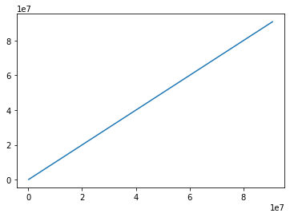
    


The df only shows locations where there are probable methylated bases, to have a look at methylation across the chromosome we can perform the following:
- Initialise an empty DF.
- Generate a chromStart column for range(0, and max value of ChromY).
    - This does have the caveat of not being the complete size of the chromosome and so there may be a section of non-methylated sequence after the plot.
- This new column needs to be converted to float.


```python
df2 = pd.DataFrame()

df2['chromStart'] = list(range(0, chromY_ZT03['chromStart'].max()))

df2['chromStart'] = df2['chromStart'].astype(float)
```

Create placeholder column for percentage of reads which are methylated.


```python
df2['PercentMeth'] = None
```

Merge the chromosome "full representation" with the df containing mostly methylated sequence.


```python
Ychrom = df2.merge(chromY_ZT03, on=['chromStart'], how='left')
```

Fill any NaN values with 0.


```python
Ychrom['ActualPercentMeth'] = Ychrom['ActualPercentMeth'].fillna(0)
```

As the below function shows, 99.9% of the sequence has no methylation in ZT03:


```python
zeros = 0
nonzeros = 0
for i in Ychrom['ActualPercentMeth']:
    if i == 0.0:
        zeros += 1
    elif i > 0.0:
        nonzeros += 1
        
total_bases = zeros + nonzeros

print(f'Count of Zeros: \t {zeros}')
print(f'Count of Non-Zeros: \t{nonzeros}')
print(f'Percentage of Zeros: \t{(zeros / total_bases) * 100}')
print(f'Percentage of Non-Zeros: {(nonzeros / total_bases) * 100}')
```

    Count of Zeros: 	 90786904
    Count of Non-Zeros: 	42995
    Percentage of Zeros: 	99.95266426532082
    Percentage of Non-Zeros: 0.04733573467917211


Now we can generate a line plot which shows the percentage likelihood of a nucleotide's read indicating methylation across chromosome Y length.


```python
fig, ax = plt.subplots()
ax.plot(Ychrom['ActualPercentMeth'].astype(int), linewidth=0.05)

width = 20
height = 6
fig.set_size_inches(width, height)
```


    
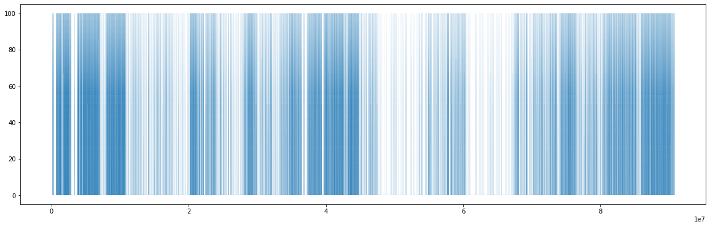
    


## Utilise 2-dimensional arrays for processing data 
Using Pandas we can manipulate the multiple bed files and generate a singular data table representing the effect of time on the metylation across the entire genome.
This requires reading all data and generating a data frame which will focus on one chromosome and then plot a graph to show methylation of a chromosome over time.


```python
ZT00 = pd.read_csv('./data/ZT00_methylation_data.bed', sep='\t', header=None)
ZT03 = pd.read_csv('./data/ZT03_methylation_data.bed', sep='\t', header=None)
ZT06 = pd.read_csv('./data/ZT06_methylation_data.bed', sep='\t', header=None)
ZT09 = pd.read_csv('./data/ZT09_methylation_data.bed', sep='\t', header=None)
ZT12 = pd.read_csv('./data/ZT12_methylation_data.bed', sep='\t', header=None)
ZT16 = pd.read_csv('./data/ZT16_methylation_data.bed', sep='\t', header=None)
```


```python
header = ['chrom', 'chromStart', 'chromEnd', 'percentMeth-reads', 'placeholder1', 'strand', 'placeholder2', 'placeholder3', 'RGBcode']
ZT00.columns = header[:len(ZT00.columns)]
ZT03.columns = header[:len(ZT03.columns)]
ZT06.columns = header[:len(ZT06.columns)]
ZT09.columns = header[:len(ZT09.columns)]
ZT12.columns = header[:len(ZT12.columns)]
ZT16.columns = header[:len(ZT16.columns)]
```

Cut down to one chromosome, like above we will use Y.


```python
chromY_ZT00 = ZT00[ZT00['chrom'] == 'chrY']
chromY_ZT03 = ZT03[ZT03['chrom'] == 'chraY']
chromY_ZT06 = ZT06[ZT06['chrom'] == 'chrY']
chromY_ZT09 = ZT09[ZT09['chrom'] == 'chrY']
chromY_ZT12 = ZT12[ZT12['chrom'] == 'chrY']
chromY_ZT16 = ZT16[ZT16['chrom'] == 'chrY']
```


```python
chromY_ZT00
```


<div>
<style scoped>
    .dataframe tbody tr th:only-of-type {
        vertical-align: middle;
    }

    .dataframe tbody tr th {
        vertical-align: top;
    }

    .dataframe thead th {
        text-align: right;
    }
</style>
<table border="1" class="dataframe">
  <thead>
    <tr style="text-align: right;">
      <th></th>
      <th>chrom</th>
      <th>chromStart</th>
      <th>chromEnd</th>
      <th>percentMeth-reads</th>
      <th>placeholder1</th>
      <th>strand</th>
      <th>placeholder2</th>
      <th>placeholder3</th>
      <th>RGBcode</th>
    </tr>
  </thead>
  <tbody>
    <tr>
      <th>17536672</th>
      <td>chrY</td>
      <td>10003388</td>
      <td>10003389</td>
      <td>1.00-2</td>
      <td>0</td>
      <td>+</td>
      <td>0</td>
      <td>0</td>
      <td>210,27,27</td>
    </tr>
    <tr>
      <th>17536673</th>
      <td>chrY</td>
      <td>10004258</td>
      <td>10004259</td>
      <td>0.50-2</td>
      <td>0</td>
      <td>+</td>
      <td>0</td>
      <td>0</td>
      <td>27,74,210</td>
    </tr>
    <tr>
      <th>17536674</th>
      <td>chrY</td>
      <td>10004260</td>
      <td>10004261</td>
      <td>0.50-2</td>
      <td>0</td>
      <td>+</td>
      <td>0</td>
      <td>0</td>
      <td>27,74,210</td>
    </tr>
    <tr>
      <th>17536675</th>
      <td>chrY</td>
      <td>10004398</td>
      <td>10004399</td>
      <td>1.00-1</td>
      <td>0</td>
      <td>+</td>
      <td>0</td>
      <td>0</td>
      <td>210,27,27</td>
    </tr>
    <tr>
      <th>17536676</th>
      <td>chrY</td>
      <td>10004408</td>
      <td>10004409</td>
      <td>0.00-1</td>
      <td>0</td>
      <td>+</td>
      <td>0</td>
      <td>0</td>
      <td>0,0,0</td>
    </tr>
    <tr>
      <th>...</th>
      <td>...</td>
      <td>...</td>
      <td>...</td>
      <td>...</td>
      <td>...</td>
      <td>...</td>
      <td>...</td>
      <td>...</td>
      <td>...</td>
    </tr>
    <tr>
      <th>17576614</th>
      <td>chrY</td>
      <td>9995953</td>
      <td>9995954</td>
      <td>1.00-2</td>
      <td>0</td>
      <td>+</td>
      <td>0</td>
      <td>0</td>
      <td>210,27,27</td>
    </tr>
    <tr>
      <th>17576615</th>
      <td>chrY</td>
      <td>999660</td>
      <td>999661</td>
      <td>1.00-2</td>
      <td>0</td>
      <td>+</td>
      <td>0</td>
      <td>0</td>
      <td>210,27,27</td>
    </tr>
    <tr>
      <th>17576616</th>
      <td>chrY</td>
      <td>999671</td>
      <td>999672</td>
      <td>1.00-3</td>
      <td>0</td>
      <td>+</td>
      <td>0</td>
      <td>0</td>
      <td>210,27,27</td>
    </tr>
    <tr>
      <th>17576617</th>
      <td>chrY</td>
      <td>999735</td>
      <td>999736</td>
      <td>1.00-1</td>
      <td>0</td>
      <td>+</td>
      <td>0</td>
      <td>0</td>
      <td>210,27,27</td>
    </tr>
    <tr>
      <th>17576618</th>
      <td>chrY</td>
      <td>999763</td>
      <td>999764</td>
      <td>1.00-1</td>
      <td>0</td>
      <td>+</td>
      <td>0</td>
      <td>0</td>
      <td>210,27,27</td>
    </tr>
  </tbody>
</table>
<p>39947 rows × 9 columns</p>
</div>


Like in the previous section we will now split 'percentMeth-reads' into 'percentMeth'and 'MethReads' to return data on percentage of reads which indicate methylation and number of reads.


```python
chromY_ZT00[['percentMeth', 'MethReads']] = chromY_ZT00['percentMeth-reads'].str.split('-', 1, expand=True)
chromY_ZT03[['percentMeth', 'MethReads']] = chromY_ZT03['percentMeth-reads'].str.split('-', 1, expand=True)
chromY_ZT06[['percentMeth', 'MethReads']] = chromY_ZT06['percentMeth-reads'].str.split('-', 1, expand=True)
chromY_ZT09[['percentMeth', 'MethReads']] = chromY_ZT09['percentMeth-reads'].str.split('-', 1, expand=True)
chromY_ZT12[['percentMeth', 'MethReads']] = chromY_ZT12['percentMeth-reads'].str.split('-', 1, expand=True)
chromY_ZT16[['percentMeth', 'MethReads']] = chromY_ZT16['percentMeth-reads'].str.split('-', 1, expand=True)
```

    /Users/dp24/Library/Python/3.8/lib/python/site-packages/pandas/core/frame.py:3188: SettingWithCopyWarning: 
    A value is trying to be set on a copy of a slice from a DataFrame.
    Try using .loc[row_indexer,col_indexer] = value instead
    
    See the caveats in the documentation: https://pandas.pydata.org/pandas-docs/stable/user_guide/indexing.html#returning-a-view-versus-a-copy
      self[k1] = value[k2]


```python
chromY_ZT00.drop(['percentMeth-reads','placeholder1','placeholder2','placeholder3','RGBcode','strand','chromEnd','chrom','MethReads'], axis=1)
chromY_ZT03.drop(['percentMeth-reads','placeholder1','placeholder2','placeholder3','RGBcode','strand','chromEnd','chrom','MethReads'], axis=1)
chromY_ZT06.drop(['percentMeth-reads','placeholder1','placeholder2','placeholder3','RGBcode','strand','chromEnd','chrom','MethReads'], axis=1)
chromY_ZT09.drop(['percentMeth-reads','placeholder1','placeholder2','placeholder3','RGBcode','strand','chromEnd','chrom','MethReads'], axis=1)
chromY_ZT12.drop(['percentMeth-reads','placeholder1','placeholder2','placeholder3','RGBcode','strand','chromEnd','chrom','MethReads'], axis=1)
chromY_ZT16.drop(['percentMeth-reads','placeholder1','placeholder2','placeholder3','RGBcode','strand','chromEnd','chrom','MethReads'], axis=1)
```


<div>
<style scoped>
    .dataframe tbody tr th:only-of-type {
        vertical-align: middle;
    }

    .dataframe tbody tr th {
        vertical-align: top;
    }

    .dataframe thead th {
        text-align: right;
    }
</style>
<table border="1" class="dataframe">
  <thead>
    <tr style="text-align: right;">
      <th></th>
      <th>chromStart</th>
      <th>percentMeth</th>
    </tr>
  </thead>
  <tbody>
    <tr>
      <th>18668806</th>
      <td>10000018</td>
      <td>1.00</td>
    </tr>
    <tr>
      <th>18668807</th>
      <td>10000040</td>
      <td>1.00</td>
    </tr>
    <tr>
      <th>18668808</th>
      <td>10000813</td>
      <td>0.50</td>
    </tr>
    <tr>
      <th>18668809</th>
      <td>10002557</td>
      <td>1.00</td>
    </tr>
    <tr>
      <th>18668810</th>
      <td>10003388</td>
      <td>1.00</td>
    </tr>
    <tr>
      <th>...</th>
      <td>...</td>
      <td>...</td>
    </tr>
    <tr>
      <th>18717772</th>
      <td>9996891</td>
      <td>1.00</td>
    </tr>
    <tr>
      <th>18717773</th>
      <td>999735</td>
      <td>1.00</td>
    </tr>
    <tr>
      <th>18717774</th>
      <td>999763</td>
      <td>0.50</td>
    </tr>
    <tr>
      <th>18717775</th>
      <td>9998876</td>
      <td>0.50</td>
    </tr>
    <tr>
      <th>18717776</th>
      <td>9999488</td>
      <td>1.00</td>
    </tr>
  </tbody>
</table>
<p>48971 rows × 2 columns</p>
</div>


Rename Headers to simplify the merging of dataframes.


```python
chromY_ZT00.rename({'percentMeth':'ZT00'}, inplace=True, axis=1)
chromY_ZT03.rename({'percentMeth':'ZT03'}, inplace=True, axis=1)
chromY_ZT06.rename({'percentMeth':'ZT06'}, inplace=True, axis=1)
chromY_ZT09.rename({'percentMeth':'ZT09'}, inplace=True, axis=1)
chromY_ZT12.rename({'percentMeth':'ZT12'}, inplace=True, axis=1)
chromY_ZT16.rename({'percentMeth':'ZT16'}, inplace=True, axis=1)
```

    /Users/dp24/Library/Python/3.8/lib/python/site-packages/pandas/core/frame.py:4438: SettingWithCopyWarning: 
    A value is trying to be set on a copy of a slice from a DataFrame
    
    See the caveats in the documentation: https://pandas.pydata.org/pandas-docs/stable/user_guide/indexing.html#returning-a-view-versus-a-copy
      return super().rename(


```python
chromY_ZT00.drop(['percentMeth-reads','placeholder1','placeholder2','placeholder3','RGBcode','strand','chromEnd','chrom','MethReads'], axis=1)
chromY_ZT03.drop(['percentMeth-reads','placeholder1','placeholder2','placeholder3','RGBcode','strand','chromEnd','chrom','MethReads'], axis=1)
chromY_ZT06.drop(['percentMeth-reads','placeholder1','placeholder2','placeholder3','RGBcode','strand','chromEnd','chrom','MethReads'], axis=1)
chromY_ZT09.drop(['percentMeth-reads','placeholder1','placeholder2','placeholder3','RGBcode','strand','chromEnd','chrom','MethReads'], axis=1)
chromY_ZT12.drop(['percentMeth-reads','placeholder1','placeholder2','placeholder3','RGBcode','strand','chromEnd','chrom','MethReads'], axis=1)
chromY_ZT16.drop(['percentMeth-reads','placeholder1','placeholder2','placeholder3','RGBcode','strand','chromEnd','chrom','MethReads'], axis=1)
```


<div>
<style scoped>
    .dataframe tbody tr th:only-of-type {
        vertical-align: middle;
    }

    .dataframe tbody tr th {
        vertical-align: top;
    }

    .dataframe thead th {
        text-align: right;
    }
</style>
<table border="1" class="dataframe">
  <thead>
    <tr style="text-align: right;">
      <th></th>
      <th>chromStart</th>
      <th>ZT16</th>
    </tr>
  </thead>
  <tbody>
    <tr>
      <th>18668806</th>
      <td>10000018</td>
      <td>1.00</td>
    </tr>
    <tr>
      <th>18668807</th>
      <td>10000040</td>
      <td>1.00</td>
    </tr>
    <tr>
      <th>18668808</th>
      <td>10000813</td>
      <td>0.50</td>
    </tr>
    <tr>
      <th>18668809</th>
      <td>10002557</td>
      <td>1.00</td>
    </tr>
    <tr>
      <th>18668810</th>
      <td>10003388</td>
      <td>1.00</td>
    </tr>
    <tr>
      <th>...</th>
      <td>...</td>
      <td>...</td>
    </tr>
    <tr>
      <th>18717772</th>
      <td>9996891</td>
      <td>1.00</td>
    </tr>
    <tr>
      <th>18717773</th>
      <td>999735</td>
      <td>1.00</td>
    </tr>
    <tr>
      <th>18717774</th>
      <td>999763</td>
      <td>0.50</td>
    </tr>
    <tr>
      <th>18717775</th>
      <td>9998876</td>
      <td>0.50</td>
    </tr>
    <tr>
      <th>18717776</th>
      <td>9999488</td>
      <td>1.00</td>
    </tr>
  </tbody>
</table>
<p>48971 rows × 2 columns</p>
</div>


As ZT00 is the largest dataframe, we will base the "full representation" on that data.


```python
allData = pd.DataFrame()
allData['chromStart'] = list(range(0, chromY_ZT00['chromStart'].max()))
```

Now we can merge the data into one dataframe.


```python
allData = pd.merge(allData, chromY_ZT00[['chromStart', 'ZT00']].astype(float), how='left', on="chromStart")
allData = pd.merge(allData, chromY_ZT03[['chromStart', 'ZT03']].astype(float), how='left', on="chromStart")
allData = pd.merge(allData, chromY_ZT06[['chromStart', 'ZT06']].astype(float), how='left', on="chromStart")
allData = pd.merge(allData, chromY_ZT09[['chromStart', 'ZT09']].astype(float), how='left', on="chromStart")
allData = pd.merge(allData, chromY_ZT12[['chromStart', 'ZT12']].astype(float), how='left', on="chromStart")
allData = pd.merge(allData, chromY_ZT16[['chromStart', 'ZT16']].astype(float), how='left', on="chromStart")
```


```python
allData
```


<div>
<style scoped>
    .dataframe tbody tr th:only-of-type {
        vertical-align: middle;
    }

    .dataframe tbody tr th {
        vertical-align: top;
    }

    .dataframe thead th {
        text-align: right;
    }
</style>
<table border="1" class="dataframe">
  <thead>
    <tr style="text-align: right;">
      <th></th>
      <th>chromStart</th>
      <th>ZT00</th>
      <th>ZT03</th>
      <th>ZT06</th>
      <th>ZT09</th>
      <th>ZT12</th>
      <th>ZT16</th>
    </tr>
  </thead>
  <tbody>
    <tr>
      <th>0</th>
      <td>0</td>
      <td>NaN</td>
      <td>NaN</td>
      <td>NaN</td>
      <td>NaN</td>
      <td>NaN</td>
      <td>NaN</td>
    </tr>
    <tr>
      <th>1</th>
      <td>1</td>
      <td>NaN</td>
      <td>NaN</td>
      <td>NaN</td>
      <td>NaN</td>
      <td>NaN</td>
      <td>NaN</td>
    </tr>
    <tr>
      <th>2</th>
      <td>2</td>
      <td>NaN</td>
      <td>NaN</td>
      <td>NaN</td>
      <td>NaN</td>
      <td>NaN</td>
      <td>NaN</td>
    </tr>
    <tr>
      <th>3</th>
      <td>3</td>
      <td>NaN</td>
      <td>NaN</td>
      <td>NaN</td>
      <td>NaN</td>
      <td>NaN</td>
      <td>NaN</td>
    </tr>
    <tr>
      <th>4</th>
      <td>4</td>
      <td>NaN</td>
      <td>NaN</td>
      <td>NaN</td>
      <td>NaN</td>
      <td>NaN</td>
      <td>NaN</td>
    </tr>
    <tr>
      <th>...</th>
      <td>...</td>
      <td>...</td>
      <td>...</td>
      <td>...</td>
      <td>...</td>
      <td>...</td>
      <td>...</td>
    </tr>
    <tr>
      <th>90830899</th>
      <td>90830899</td>
      <td>NaN</td>
      <td>NaN</td>
      <td>NaN</td>
      <td>NaN</td>
      <td>NaN</td>
      <td>NaN</td>
    </tr>
    <tr>
      <th>90830900</th>
      <td>90830900</td>
      <td>NaN</td>
      <td>NaN</td>
      <td>NaN</td>
      <td>NaN</td>
      <td>NaN</td>
      <td>NaN</td>
    </tr>
    <tr>
      <th>90830901</th>
      <td>90830901</td>
      <td>NaN</td>
      <td>NaN</td>
      <td>NaN</td>
      <td>NaN</td>
      <td>NaN</td>
      <td>NaN</td>
    </tr>
    <tr>
      <th>90830902</th>
      <td>90830902</td>
      <td>NaN</td>
      <td>NaN</td>
      <td>NaN</td>
      <td>NaN</td>
      <td>NaN</td>
      <td>NaN</td>
    </tr>
    <tr>
      <th>90830903</th>
      <td>90830903</td>
      <td>NaN</td>
      <td>NaN</td>
      <td>NaN</td>
      <td>NaN</td>
      <td>NaN</td>
      <td>NaN</td>
    </tr>
  </tbody>
</table>
<p>90830904 rows × 7 columns</p>
</div>


To observe some basic statistics on the data we can use pandas.count() (ran prior to .fillna() to count raw data) to return the number of cells per column and then pandas.describe() to return basic statistics on the data. In this second case, we will only need to take note of the first row which shows the valid data (nucleotide bases in which methylation may be indicated) brought in from the original data.


```python
allData.count()
```


    chromStart    90830904
    ZT00             39946
    ZT03             49423
    ZT06             47901
    ZT09             45293
    ZT12             37109
    ZT16             48971
    dtype: int64


```python
allData.describe()
```


<div>
<style scoped>
    .dataframe tbody tr th:only-of-type {
        vertical-align: middle;
    }

    .dataframe tbody tr th {
        vertical-align: top;
    }

    .dataframe thead th {
        text-align: right;
    }
</style>
<table border="1" class="dataframe">
  <thead>
    <tr style="text-align: right;">
      <th></th>
      <th>chromStart</th>
      <th>ZT00</th>
      <th>ZT03</th>
      <th>ZT06</th>
      <th>ZT09</th>
      <th>ZT12</th>
      <th>ZT16</th>
    </tr>
  </thead>
  <tbody>
    <tr>
      <th>count</th>
      <td>9.083090e+07</td>
      <td>39946.000000</td>
      <td>49423.000000</td>
      <td>47901.000000</td>
      <td>45293.000000</td>
      <td>37109.000000</td>
      <td>48971.000000</td>
    </tr>
    <tr>
      <th>mean</th>
      <td>4.541545e+07</td>
      <td>0.781523</td>
      <td>0.781715</td>
      <td>0.767885</td>
      <td>0.781540</td>
      <td>0.796533</td>
      <td>0.758298</td>
    </tr>
    <tr>
      <th>std</th>
      <td>2.622062e+07</td>
      <td>0.364182</td>
      <td>0.352326</td>
      <td>0.369485</td>
      <td>0.359238</td>
      <td>0.356887</td>
      <td>0.369817</td>
    </tr>
    <tr>
      <th>min</th>
      <td>0.000000e+00</td>
      <td>0.000000</td>
      <td>0.000000</td>
      <td>0.000000</td>
      <td>0.000000</td>
      <td>0.000000</td>
      <td>0.000000</td>
    </tr>
    <tr>
      <th>25%</th>
      <td>2.270773e+07</td>
      <td>0.670000</td>
      <td>0.670000</td>
      <td>0.500000</td>
      <td>0.670000</td>
      <td>0.670000</td>
      <td>0.500000</td>
    </tr>
    <tr>
      <th>50%</th>
      <td>4.541545e+07</td>
      <td>1.000000</td>
      <td>1.000000</td>
      <td>1.000000</td>
      <td>1.000000</td>
      <td>1.000000</td>
      <td>1.000000</td>
    </tr>
    <tr>
      <th>75%</th>
      <td>6.812318e+07</td>
      <td>1.000000</td>
      <td>1.000000</td>
      <td>1.000000</td>
      <td>1.000000</td>
      <td>1.000000</td>
      <td>1.000000</td>
    </tr>
    <tr>
      <th>max</th>
      <td>9.083090e+07</td>
      <td>1.000000</td>
      <td>1.000000</td>
      <td>1.000000</td>
      <td>1.000000</td>
      <td>1.000000</td>
      <td>1.000000</td>
    </tr>
  </tbody>
</table>
</div>


Now to clear the NaN data from the dataset and replace it with 0.0, a float to mimic the other data.


```python
allData['ZT00'] = allData['ZT00'].fillna(0.0)
allData['ZT03'] = allData['ZT03'].fillna(0.0)
allData['ZT06'] = allData['ZT06'].fillna(0.0)
allData['ZT09'] = allData['ZT09'].fillna(0.0)
allData['ZT12'] = allData['ZT12'].fillna(0.0)
allData['ZT16'] = allData['ZT16'].fillna(0.0)
```

# Produce TSV file for analysis

Now that much of the transformational work has been performed on the data, it will be exported as a TSV to allow for external verification.


```python
allData.to_csv('time_series_murine_methylation.tsv', sep="\t")
```

Now to read that data back into the IPYNB for analysis.


```python
allData = pd.read_csv('time_series_murine_methylation.tsv', sep='\t')
```


```python
allData.drop(['Unnamed: 0'], axis=1)
```


<div>
<style scoped>
    .dataframe tbody tr th:only-of-type {
        vertical-align: middle;
    }

    .dataframe tbody tr th {
        vertical-align: top;
    }

    .dataframe thead th {
        text-align: right;
    }
</style>
<table border="1" class="dataframe">
  <thead>
    <tr style="text-align: right;">
      <th></th>
      <th>chromStart</th>
      <th>ZT00</th>
      <th>ZT03</th>
      <th>ZT06</th>
      <th>ZT09</th>
      <th>ZT12</th>
      <th>ZT16</th>
    </tr>
  </thead>
  <tbody>
    <tr>
      <th>0</th>
      <td>0</td>
      <td>0.0</td>
      <td>0.0</td>
      <td>0.0</td>
      <td>0.0</td>
      <td>0.0</td>
      <td>0.0</td>
    </tr>
    <tr>
      <th>1</th>
      <td>1</td>
      <td>0.0</td>
      <td>0.0</td>
      <td>0.0</td>
      <td>0.0</td>
      <td>0.0</td>
      <td>0.0</td>
    </tr>
    <tr>
      <th>2</th>
      <td>2</td>
      <td>0.0</td>
      <td>0.0</td>
      <td>0.0</td>
      <td>0.0</td>
      <td>0.0</td>
      <td>0.0</td>
    </tr>
    <tr>
      <th>3</th>
      <td>3</td>
      <td>0.0</td>
      <td>0.0</td>
      <td>0.0</td>
      <td>0.0</td>
      <td>0.0</td>
      <td>0.0</td>
    </tr>
    <tr>
      <th>4</th>
      <td>4</td>
      <td>0.0</td>
      <td>0.0</td>
      <td>0.0</td>
      <td>0.0</td>
      <td>0.0</td>
      <td>0.0</td>
    </tr>
    <tr>
      <th>...</th>
      <td>...</td>
      <td>...</td>
      <td>...</td>
      <td>...</td>
      <td>...</td>
      <td>...</td>
      <td>...</td>
    </tr>
    <tr>
      <th>90830899</th>
      <td>90830899</td>
      <td>0.0</td>
      <td>0.0</td>
      <td>0.0</td>
      <td>0.0</td>
      <td>0.0</td>
      <td>0.0</td>
    </tr>
    <tr>
      <th>90830900</th>
      <td>90830900</td>
      <td>0.0</td>
      <td>0.0</td>
      <td>0.0</td>
      <td>0.0</td>
      <td>0.0</td>
      <td>0.0</td>
    </tr>
    <tr>
      <th>90830901</th>
      <td>90830901</td>
      <td>0.0</td>
      <td>0.0</td>
      <td>0.0</td>
      <td>0.0</td>
      <td>0.0</td>
      <td>0.0</td>
    </tr>
    <tr>
      <th>90830902</th>
      <td>90830902</td>
      <td>0.0</td>
      <td>0.0</td>
      <td>0.0</td>
      <td>0.0</td>
      <td>0.0</td>
      <td>0.0</td>
    </tr>
    <tr>
      <th>90830903</th>
      <td>90830903</td>
      <td>0.0</td>
      <td>0.0</td>
      <td>0.0</td>
      <td>0.0</td>
      <td>0.0</td>
      <td>0.0</td>
    </tr>
  </tbody>
</table>
<p>90830904 rows × 7 columns</p>
</div>


We can now plot chromosome length graphs using this data with the following matplotlib function to create horizontal subplots per time set.

Note that in this plot, linewidth is effectively the resolution of the plot.


```python
fig, ax = plt.subplots(6)
linewidth = 0.05
ax[0].plot(allData['ZT00'], linewidth=linewidth)
ax[1].plot(allData['ZT03'], linewidth=linewidth)
ax[2].plot(allData['ZT06'], linewidth=linewidth)
ax[3].plot(allData['ZT09'], linewidth=linewidth)
ax[4].plot(allData['ZT12'], linewidth=linewidth)
ax[5].plot(allData['ZT16'], linewidth=linewidth)

ax[5].set_xlabel('Genomic Location (10 megabase pair)')
ax[3].set_ylabel('Percentage of reads indicating methylation')
ax[0].set_title('Methylation sites across a subsample of the murine Y chromosome')

width = 20
height = 16
fig.set_size_inches(width, height)
```


    
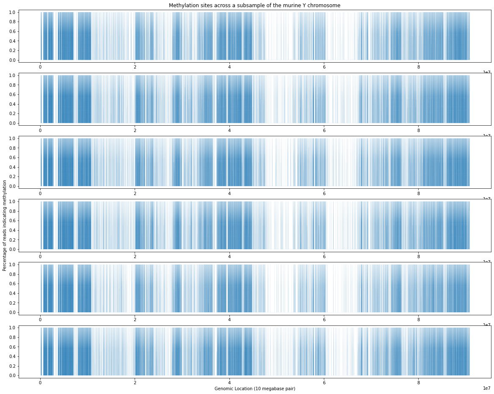
    


As can be seen in the above graphs, visually there is very little change (the most notable being in the 40mbp and 60mbp regions). This can be explained by the fact that the changes in the count of methylated bases make up such a small amount of the data. Methylated bases change by ~10kbp in 90mbp of chromosome ( 0.01% ).

## Regions in Detail
Next, we will look at those regions in detail.


```python
around40 = allData.loc[(allData['chromStart'] >= 37500000) & (allData['chromStart'] <= 52500000)].fillna(0.0)
around60 = allData.loc[(allData['chromStart'] >= 60000000) & (allData['chromStart'] <= 70000000)].fillna(0.0)
```


```python
fig, ax = plt.subplots(6)
linewidth = 0.05

# Plot data
ax[0].plot(around40['ZT00'], linewidth=linewidth)
ax[1].plot(around40['ZT03'], linewidth=linewidth)
ax[2].plot(around40['ZT06'], linewidth=linewidth)
ax[3].plot(around40['ZT09'], linewidth=linewidth)
ax[4].plot(around40['ZT12'], linewidth=linewidth)
ax[5].plot(around40['ZT16'], linewidth=linewidth)

# Set Labels 
ax[5].set_xlabel('Genomic Location (base pair)')
ax[3].set_ylabel('Percentage of reads indicating methylation')
ax[0].set_title('Methylation sites across a subsample of the murine Y chromosome')

width = 20
height = 16
fig.set_size_inches(width, height)
```


    
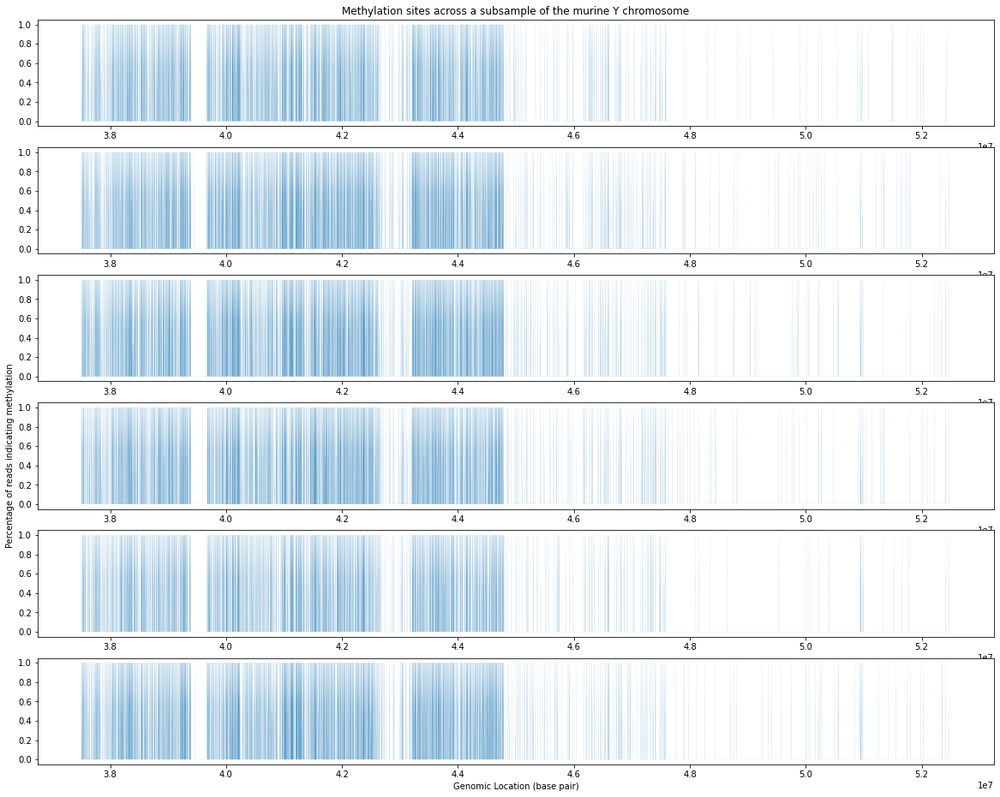
    


The most notable change in this region is at 44mbp where there are genes linked to Y-linked testis-specific protein 1-like proteins.


```python
fig, ax = plt.subplots(6)
linewidth = 0.05

# Plot Data
ax[0].plot(around60['ZT00'], linewidth=linewidth)
ax[1].plot(around60['ZT03'], linewidth=linewidth)
ax[2].plot(around60['ZT06'], linewidth=linewidth)
ax[3].plot(around60['ZT09'], linewidth=linewidth)
ax[4].plot(around60['ZT12'], linewidth=linewidth)
ax[5].plot(around60['ZT16'], linewidth=linewidth)

# Set Labels
ax[5].set_xlabel('Genomic Location (base pair)')
ax[3].set_ylabel('Percentage of reads indicating methylation')
ax[0].set_title('Methylation sites across a subsample of the murine Y chromosome')

width = 20
height = 16
fig.set_size_inches(width, height)
```


    
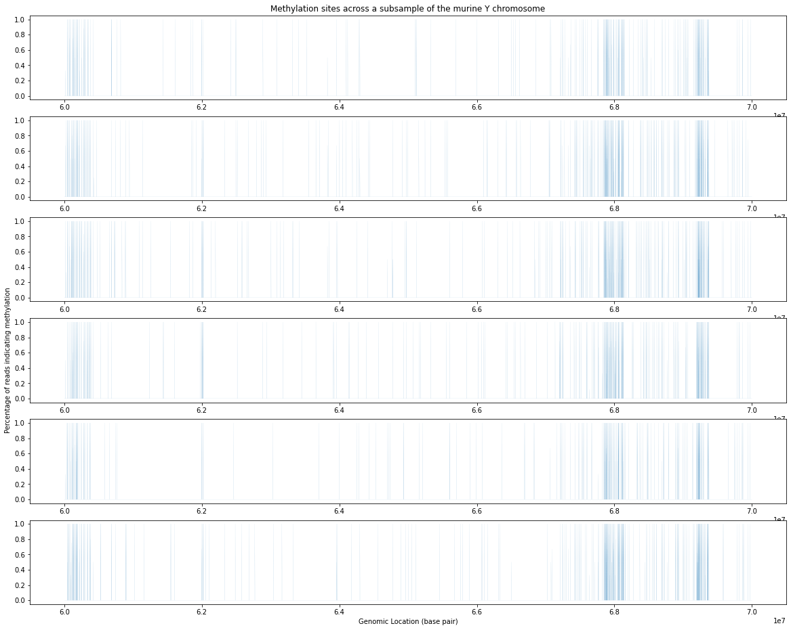
    


Interestingly, the genes found at the 60-61mbp range are genes ( most notably (mn) Gm28891 ) for spermatid development, and the graph above shows that they become more methylated at night.
This is the same case at ~68mbp (mn Gm20937 ) and ~70mpb (mn Gm21160 ) where there are genes for spermatid development and Y-linked testis-specific protein 1-like proteins, respectively.

## Identify a model that contains a representation of part of your system

First we will solve and graph the biomodel example from the biomodel produced by Bertozzi (2020) which aimed to provide an SIR model of COVID-19 spread in California (CA) and New York (NY). 

Second, this graph could be expanded to model the current (27th July, 2022) COVID-19 resurgence in England, UK. This will focus on England due to the unique performance in COVID-19 control relative to neigbouring countries.

The initial number of infected: the total number of people thought to have COVID-19 as of 27th July, 2022. According to ONS data this is 3.2 million individuals or 5.7% of those living in England.


```python
# First install smbltoodepy and import it to the environment.
!pip3 install sbmltoodepy
```

    Defaulting to user installation because normal site-packages is not writeable
    Requirement already satisfied: sbmltoodepy in /Users/dp24/Library/Python/3.8/lib/python/site-packages (1.0.4)
    Requirement already satisfied: scipy in /Users/dp24/Library/Python/3.8/lib/python/site-packages (from sbmltoodepy) (1.8.0)
    Requirement already satisfied: python-libsbml in /Users/dp24/Library/Python/3.8/lib/python/site-packages (from sbmltoodepy) (5.19.5)
    Requirement already satisfied: numpy in /Users/dp24/Library/Python/3.8/lib/python/site-packages (from sbmltoodepy) (1.19.5)
    WARNING: There was an error checking the latest version of pip.
    


```python
import sbmltoodepy
import numpy as np
```

# COVID-19 Model

Make a new folder to store data and download the Bertozzi (2020) model from BioModels.

**NOTE** As of time of submission the biomodel site has crashed and it is unknown when the service will be running again, the model file will be available on the GitHub page for this coursework.


```python
!mkdir data_model
!wget https://www.ebi.ac.uk/biomodels/model/download/BIOMD0000000956.9?filename=Bertozzi2020.xml -O bertozzi.xml
!mv bertozzi.xml data_model/
```

    mkdir: data_model: File exists
    --2022-07-27 12:18:01--  https://www.ebi.ac.uk/biomodels/model/download/BIOMD0000000956.9?filename=Bertozzi2020.xml
    Resolving www.ebi.ac.uk (www.ebi.ac.uk)... 193.62.192.80
    Connecting to www.ebi.ac.uk (www.ebi.ac.uk)|193.62.192.80|:443... connected.
    HTTP request sent, awaiting response... 500 Internal Server Error
    2022-07-27 12:18:01 ERROR 500: Internal Server Error.
    


Use SBML to ODE to convert the Bertozzi model into an ODE model for use in Python with new data.

**NOTICE** Because of the afore mentioned error, this step also fails. However as a back up is available (in the associated GitHub repo) it can still be imported.


```python
sbmltoodepy.ParseAndCreateModel("./data_model/bertozzi.xml", outputFilePath = "bertozzi_model.py", className = "BertozziModel")
```


    ----------------------------------------------------------------------

    AssertionError                       Traceback (most recent call last)

    <ipython-input-22-33479ed32728> in <module>
    ----> 1 sbmltoodepy.ParseAndCreateModel("./data_model/bertozzi.xml", outputFilePath = "bertozzi_model.py", className = "BertozziModel")
    

    ~/Library/Python/3.8/lib/python/site-packages/sbmltoodepy/utilities.py in ParseAndCreateModel(inputFilePath, jsonFilePath, outputFilePath, className)
         64             outputFilePath = inputFilePath + '.py'
         65 
    ---> 66     modelData = ParseSBMLFile(inputFilePath)
         67     if not jsonFilePath == None:
         68         modelData.DumpToJSON(jsonFilePath)


    ~/Library/Python/3.8/lib/python/site-packages/sbmltoodepy/parse.py in ParseSBMLFile(filePath)
        282     doc = libsbml.readSBML(filePath)
        283 
    --> 284     assert(doc.getNumErrors() == 0)
        285 
        286     model = doc.getModel()


    AssertionError: 


```python
from bertozzi_model import BertozziModel
```


```python
modelInstance = BertozziModel()
print(f"True (1) / false (0) is lockdown active: {modelInstance.p['Trigger_CA'].value}")
print(f"Lockdown start date: {modelInstance.p['Lockdown_CA_start'].value}")
print(f"Lockdown end date:   {modelInstance.p['Lockdown_CA_end'].value}")
print(f"Number of initial infected: {modelInstance.s['Infected'].concentration}")
```

    True (1) / false (0) is lockdown active: 1.0
    Lockdown start date: 27.0
    Lockdown end date:   66.0
    Number of initial infected: 1.263902932254803e-07


The above is used to confirm the variables set out for use in the original paper. The models will be run simulating 161 days to mimick the original paper.


```python
time = 161

times = np.zeros(time)
times[0] = modelInstance.time
infected = np.zeros(time)
infected[0] = modelInstance.s['Infected'].concentration

timeinterval = 1
for i in range(time - 1):
    modelInstance.RunSimulation(timeinterval)
    times[i+1] = modelInstance.time
    infected[i+1] = modelInstance.s['Infected'].concentration

# Set Trigger Lockdown = 1
modelInstanceLockdown = BertozziModel()
modelInstanceLockdown.p['Trigger_Lockdown']  = sbmltoodepy.modelclasses.Parameter(1.0, 'Trigger_Lockdown', True, metadata = sbmltoodepy.modelclasses.SBMLMetadata("Trigger_Lockdown"))

timeinterval = 1
infectedL = np.zeros(time)
infectedL[0] = modelInstanceLockdown.s['Infected'].concentration
start = np.zeros(time)
start[0] = modelInstanceLockdown.p['Lockdown_CA_start'].value
end = np.zeros(time)
end[0] = modelInstanceLockdown.p['Lockdown_CA_end'].value
for i in range(time - 1):
    modelInstanceLockdown.RunSimulation(timeinterval)
    infectedL[i+1] = modelInstanceLockdown.s['Infected'].concentration
    start[i+1] = modelInstanceLockdown.p['Lockdown_CA_start'].value
    end[i+1] = modelInstanceLockdown.p['Lockdown_CA_end'].value
```

If we were to plot the graph at this point the two lines would be identical, even given changing of parameters. Reading through the bertozzi_model.py file, however, it was realised that the Lockdown start and end values were constants used for the manipulation of the data outside of the SMBL to ODE framework. With this in mind, the following code was added:


```python
lockstart = int(modelInstanceLockdown.p['Lockdown_CA_start'].value)
prepended_infected = np.concatenate(([0] * lockstart, infectedL), axis=0)
appended_infected = prepended_infected[:-lockstart]
```

This can now be plotted, mimicking the graph found in the original Bertozzi (2020) paper.


```python
fig, ax = plt.subplots()
ax.plot(times,infected, c='blue')
ax.plot(times,appended_infected, c='orange')
ax.plot(start, infected, '--', c='red')
ax.plot(end, infected, '--', c='red')

ax.set_xlabel('Days from 1 March, 2020')
ax.set_ylabel('Percentage of Population Infected')
ax.set_title('Percentage of population infected over time in CA')
ax.xaxis.set_ticks(np.arange(min(times), max(times), 10))
ax.set_xlim(0, 160)
fig.set_size_inches(12,6)

```


    
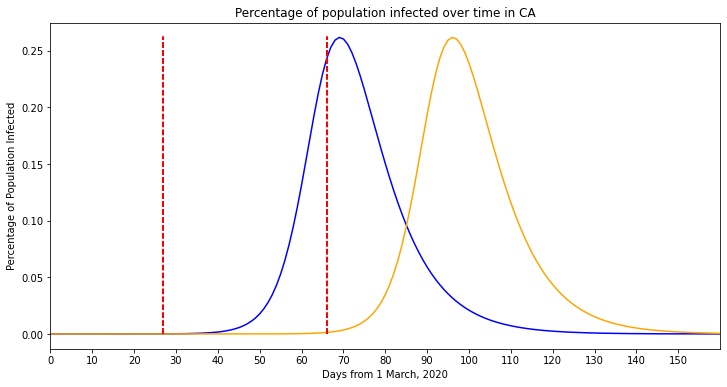
    


Taking into acount the limited modelling of this model, it seems accurate that this model relied significantly on graph manipulation.

## England COVID-19 SRI graph

The above model can now be applied to new data, we will use the current COVID-19 outbreak in England (interesting due to the unique method of control England employs).

We will need to overwrite the hardcoded data in the Bertozzi model with the following data:

- The R value for England is estimated at 0.9-1.2 (https://www.gov.uk/guidance/the-r-value-and-growth-rate#latest-r-and-growth-rate-for-england, updated 22nd July). We will use the values 1.0, 1.2 and 1.4 for modelling.
- The current number of infected persons is estimated at 3.0-3.2 million, we will use the worse case estimate (https://www.ons.gov.uk/peoplepopulationandcommunity/healthandsocialcare/conditionsanddiseases/bulletins/coronaviruscovid19infectionsurveypilot/latest#coronavirus-covid-19-infection-survey-data Updated week ending 13th July).
- The population of England is estimated to be 56.55 million people (https://www.ons.gov.uk/peoplepopulationandcommunity/populationandmigration/populationestimates, updated 25th June 2022).


```python
# Set time (Days) to generate data over (this is required so that the "infection end" can also be graphed)
time = 200

# Set other initial values
initial_infected = 3.2e+6

england_pop = 56550000.0
secondary_pop = 0.0
```

Models will now be generated per R value, this will require creating a new model instance (not doing so will lead to errors in some calculations) being made and the initial values to be set for that instance.


```python
# Generate model using the new initial values and R = 1.0

engSRI = BertozziModel()
engSRI.p['Trigger_Lockdown']  = sbmltoodepy.modelclasses.Parameter(0.0, 'Trigger_Lockdown', True, metadata = sbmltoodepy.modelclasses.SBMLMetadata("Trigger_Lockdown"))
engSRI.p['Pop_CA'] = sbmltoodepy.modelclasses.Parameter(england_pop, 'Pop_CA', True, metadata = sbmltoodepy.modelclasses.SBMLMetadata("Pop_CA"))
engSRI.p['Ro_CA'] = sbmltoodepy.modelclasses.Parameter(1.0, 'Ro_CA', False, metadata = sbmltoodepy.modelclasses.SBMLMetadata("Ro_CA"))
engSRI.s['Infected'] = sbmltoodepy.modelclasses.Species(initial_infected, 'Concentration', engSRI.c['USA___CA__NY'], False, constant = False, metadata = sbmltoodepy.modelclasses.SBMLMetadata("Infected"))
engSRI.p['Pop_NY'] = sbmltoodepy.modelclasses.Parameter(secondary_pop, 'Pop_NY', True, metadata = sbmltoodepy.modelclasses.SBMLMetadata("Pop_NY"))

times = np.zeros(time)
times[0] = engSRI.time
infected = np.zeros(time)
infected[0] = engSRI.s['Infected'].concentration

timeinterval = 1
for i in range(time - 1):
    engSRI.RunSimulation(timeinterval)
    times[i+1] = engSRI.time
    infected[i+1] = engSRI.s['Infected'].concentration
```


```python
# Generate model using the new initial values and R = 1.2

engSRI = BertozziModel()
engSRI.p['Trigger_Lockdown']  = sbmltoodepy.modelclasses.Parameter(0.0, 'Trigger_Lockdown', True, metadata = sbmltoodepy.modelclasses.SBMLMetadata("Trigger_Lockdown"))
engSRI.p['Pop_CA'] = sbmltoodepy.modelclasses.Parameter(england_pop, 'Pop_CA', True, metadata = sbmltoodepy.modelclasses.SBMLMetadata("Pop_CA"))
engSRI.p['Ro_CA'] = sbmltoodepy.modelclasses.Parameter(1.2, 'Ro_CA', False, metadata = sbmltoodepy.modelclasses.SBMLMetadata("Ro_CA"))
engSRI.s['Infected'] = sbmltoodepy.modelclasses.Species(initial_infected, 'Concentration', engSRI.c['USA___CA__NY'], False, constant = False, metadata = sbmltoodepy.modelclasses.SBMLMetadata("Infected"))
engSRI.p['Pop_NY'] = sbmltoodepy.modelclasses.Parameter(secondary_pop, 'Pop_NY', True, metadata = sbmltoodepy.modelclasses.SBMLMetadata("Pop_NY"))


times = np.zeros(time)
times[0] = engSRI.time
infected2 = np.zeros(time)
infected2[0] = engSRI.s['Infected'].concentration

timeinterval = 1
for i in range(time - 1):
    engSRI.RunSimulation(timeinterval)
    times[i+1] = engSRI.time
    infected2[i+1] = engSRI.s['Infected'].concentration
```


```python
# Generate model using the new initial values and R = 1.4

engSRI = BertozziModel()
engSRI.p['Trigger_Lockdown']  = sbmltoodepy.modelclasses.Parameter(0.0, 'Trigger_Lockdown', True, metadata = sbmltoodepy.modelclasses.SBMLMetadata("Trigger_Lockdown"))
engSRI.p['Pop_CA'] = sbmltoodepy.modelclasses.Parameter(england_pop, 'Pop_CA', True, metadata = sbmltoodepy.modelclasses.SBMLMetadata("Pop_CA"))
engSRI.p['Ro_CA'] = sbmltoodepy.modelclasses.Parameter(1.4, 'Ro_CA', False, metadata = sbmltoodepy.modelclasses.SBMLMetadata("Ro_CA"))
engSRI.s['Infected'] = sbmltoodepy.modelclasses.Species(initial_infected, 'Concentration', engSRI.c['USA___CA__NY'], False, constant = False, metadata = sbmltoodepy.modelclasses.SBMLMetadata("Infected"))
engSRI.p['Pop_NY'] = sbmltoodepy.modelclasses.Parameter(secondary_pop, 'Pop_NY', True, metadata = sbmltoodepy.modelclasses.SBMLMetadata("Pop_NY"))


times = np.zeros(time)
times[0] = engSRI.time
infected3 = np.zeros(time)
infected3[0] = engSRI.s['Infected'].concentration

timeinterval = 1
for i in range(time - 1):
    engSRI.RunSimulation(timeinterval)
    times[i+1] = engSRI.time
    infected3[i+1] = engSRI.s['Infected'].concentration
```


```python
# Max value in array
R11max = np.where(infected == max(infected))
R12max = np.where(infected2 == max(infected2))
R13max = np.where(infected3 == max(infected3))

# Min positive value in array (this will return a fraction of a person)
R11 = np.where(infected == min(infected))
R12 = np.where(infected2 == min(infected2))
R13 = np.where(infected3 == min(infected3))

# Set number of figure subplots and their organisation
fig, ax = plt.subplots(3)

xlim_max = 200
ylim_max = initial_infected + (initial_infected / 10)

# Set figure dimensions
fig.set_size_inches(15,12)

# Figure 1 for R = 1.0
ax[0].set_xlim(0, xlim_max)
ax[0].set_ylim(0, ylim_max)
ax[0].plot(times,infected ,c='blue')

# Annotate maximum infection count
ax[0].annotate(infected[R11max[0]] , (times[R11max[0]] + 3, infected[R11max[0]]), c='blue')
ax[0].plot(times[R11max[0]], infected[R11max[0]] ,
        marker='o', markerfacecolor="blue",
        markersize=10)

# Annotate minimum infection count
ax[0].annotate(infected[R11] , (times[R11] - 10, infected[R11] + 100000), c='blue')
ax[0].plot(times[R11], infected[R11] ,
        marker='o', markerfacecolor="blue",
        markersize=10)

# Annotate infection count at day 20
ax[0].annotate(round(infected[20], 3), (times[20] + 5, infected[20]), c='blue')
ax[0].plot(times[20], infected[20] ,
        marker='o', markerfacecolor="blue",
        markersize=10)

# Figure 2 for R = 1.2
ax[1].set_xlim(0, xlim_max)
ax[1].set_ylim(0, ylim_max)
ax[1].plot(times,infected2,c='yellow')

# Annotate maximum infection count
ax[1].annotate(infected2[R12max[0]], (times[R12max[0]] + 3, infected2[R12max[0]]), c='blue')
ax[1].plot(times[R12max[0]], infected2[R12max[0]] ,
        marker='o', markerfacecolor="yellow",
        markersize=10)

# Annotate minimum infection count
ax[1].annotate(infected2[R12[0]], (times[R12[0]] - 10, infected2[R12[0]] + 100000), c='blue')
ax[1].plot(times[R12], infected2[R12] ,
        marker='o', markerfacecolor="yellow",
        markersize=10)

# Annotate infection count at day 20
ax[1].annotate(round(infected2[20], 3), (times[20] + 5, infected2[20]), c='blue')
ax[1].plot(times[20], infected2[20] ,
        marker='o', markerfacecolor="yellow",
        markersize=10)

# Figure 3 for R = 1.4
ax[2].set_xlim(0, xlim_max)
ax[2].set_ylim(0, ylim_max)
ax[2].plot(times,infected3 ,c='red')

# Annotate maximum infection count
ax[2].annotate(infected3[R13max[0]], (times[R13max[0]] + 3, infected3[R13max[0]]), c='blue')
ax[2].plot(times[R13max[0]], infected3[R13max[0]] ,
        marker='o', markerfacecolor="red",
        markersize=10)

# Annotate minimum infection count
ax[2].annotate(infected3[R13], (times[R13] - 10, infected3[R13] + 100000), c='blue')
ax[2].plot(times[R13], infected3[R13] ,
        marker='o', markerfacecolor="red",
        markersize=10)

# Annotate infection count at day 20
ax[2].annotate(round(infected3[20], 3), (times[20] + 5, infected3[20]), c='blue')
ax[2].plot(times[20], infected3[20] ,
        marker='o', markerfacecolor="red",
        markersize=10)

# Set the axis Labels
ax[2].set_xlabel('Days from 18th July, 2022')
ax[1].set_ylabel('Amount of population Infected (Millions)')

# Set titles for graphs
ax[0].set_title("R = 1.0")
ax[1].set_title("R = 1.2")
ax[2].set_title("R = 1.4")
```

    /Users/dp24/Library/Python/3.8/lib/python/site-packages/matplotlib/text.py:1215: FutureWarning: elementwise comparison failed; returning scalar instead, but in the future will perform elementwise comparison
      if s != self._text:
    /Users/dp24/Library/Python/3.8/lib/python/site-packages/matplotlib/text.py:1215: FutureWarning: elementwise comparison failed; returning scalar instead, but in the future will perform elementwise comparison
      if s != self._text:
    /Users/dp24/Library/Python/3.8/lib/python/site-packages/matplotlib/text.py:1215: FutureWarning: elementwise comparison failed; returning scalar instead, but in the future will perform elementwise comparison
      if s != self._text:
    /Users/dp24/Library/Python/3.8/lib/python/site-packages/matplotlib/text.py:1215: FutureWarning: elementwise comparison failed; returning scalar instead, but in the future will perform elementwise comparison
      if s != self._text:
    /Users/dp24/Library/Python/3.8/lib/python/site-packages/matplotlib/text.py:1215: FutureWarning: elementwise comparison failed; returning scalar instead, but in the future will perform elementwise comparison
      if s != self._text:
    /Users/dp24/Library/Python/3.8/lib/python/site-packages/matplotlib/text.py:1215: FutureWarning: elementwise comparison failed; returning scalar instead, but in the future will perform elementwise comparison
      if s != self._text:


    Text(0.5, 1.0, 'R = 1.4')


    
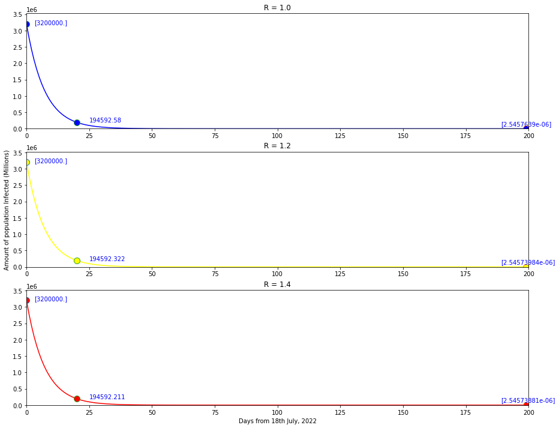
    


As can be seen above the model, with the initial value of 3.2 million infected, the graph drops quickly in all cases, with near identical case numbers. By day 20 (theoretically 15th August), all models predict that there would be just under 200,000 infected people in the population. 

This is the case even with an initial R value of 10. Changing the initial infected variable even in the original model with no other modifications produces graphs which do not behave as one would expect.

For a more typical graph, the model requires an initial infected value to be almost 0. Which erases any use of this model after the primary infection of a population (e.g. December 2019/January 2020).

This indicates that the model is too specific to the original data and cannot be easily applied to new data as above. Using the above data we should see an initial increase until the population is saturated or a lockdown decreases the R value to the point where the infection is not self-sustaining.

# Methylation Data - Model

We can also visualise the model produced by Leloup on methylation data.

**NOTICE** as with the above model, BioModels is down. A backup copy of the model is available in the GitHub Repo for this coursework.


```python
# Download the model from BioModels
!mkdir data_model
!wget https://www.ebi.ac.uk/biomodels/model/download/BIOMD0000000298.2?filename=BIOMD0000000298_url.xml -O leloup.xml
!mv leloup.xml data_model/
```

    mkdir: data_model: File exists
    --2022-07-27 12:44:21--  https://www.ebi.ac.uk/biomodels/model/download/BIOMD0000000298.2?filename=BIOMD0000000298_url.xml
    Resolving www.ebi.ac.uk (www.ebi.ac.uk)... 193.62.192.80
    Connecting to www.ebi.ac.uk (www.ebi.ac.uk)|193.62.192.80|:443... connected.
    HTTP request sent, awaiting response... 500 Internal Server Error
    2022-07-27 12:44:21 ERROR 500: Internal Server Error.
    


```python
# import sbmltoode to env
import sbmltoodepy
```


```python
sbmltoodepy.ParseAndCreateModel("./data_model/leloup.xml", outputFilePath = "leloup_model.py", className = "LeloupModel")
```


    ----------------------------------------------------------------------

    AssertionError                       Traceback (most recent call last)

    <ipython-input-39-544c44455dbf> in <module>
    ----> 1 sbmltoodepy.ParseAndCreateModel("./data_model/leloup.xml", outputFilePath = "leloup_model.py", className = "LeloupModel")
    

    ~/Library/Python/3.8/lib/python/site-packages/sbmltoodepy/utilities.py in ParseAndCreateModel(inputFilePath, jsonFilePath, outputFilePath, className)
         64             outputFilePath = inputFilePath + '.py'
         65 
    ---> 66     modelData = ParseSBMLFile(inputFilePath)
         67     if not jsonFilePath == None:
         68         modelData.DumpToJSON(jsonFilePath)


    ~/Library/Python/3.8/lib/python/site-packages/sbmltoodepy/parse.py in ParseSBMLFile(filePath)
        282     doc = libsbml.readSBML(filePath)
        283 
    --> 284     assert(doc.getNumErrors() == 0)
        285 
        286     model = doc.getModel()


    AssertionError: 


Initiate a new model from the python file and load into the environment.


```python
from leloup_model import LeloupModel
```


```python
modelInstance = LeloupModel()
```


```python
print(modelInstance.s.keys())
print(modelInstance.p.keys())
print(modelInstance.p['Pt'].value)
```

    dict_keys(['MP', 'CN', 'C', 'T2', 'T1', 'T0', 'MT', 'P0', 'P1', 'P2'])
    dict_keys(['vsP', 'vmP', 'KmP', 'KIP', 'Pt', 'ksP', 'vdP', 'KdP', 'vsT', 'vmT', 'KmT', 'KIT', 'ksT', 'vdT', 'KdT', 'kdC', 'kdN', 'k1', 'k2', 'k3', 'k4', 'kd', 'V1P', 'V1T', 'V2P', 'V2T', 'V3P', 'V3T', 'V4P', 'V4T', 'K1P', 'K1T', 'K2P', 'K2T', 'K3P', 'K3T', 'K4P', 'K4T', 'n'])
    1.6474592000000001


```python
time = 151

import numpy as np
times = np.zeros(time)
times[0] = modelInstance.time
MP = np.zeros(time)
MP[0] = modelInstance.s['MP'].concentration
CN = np.zeros(time)
CN[0] = modelInstance.s['CN'].concentration
Pt = np.zeros(time)
Pt[0] = modelInstance.p['Pt'].value
vdT = np.zeros(time)
vdT[0] = modelInstance.p['vdT'].value
timeinterval = 1
for i in range(time - 1):
    modelInstance.RunSimulation(timeinterval)
    times[i+1] = modelInstance.time
    MP[i+1] = modelInstance.s['MP'].concentration
    CN[i+1] = modelInstance.s['CN'].concentration
    Pt[i+1] = modelInstance.p['Pt'].value
    vdT[i+1] = modelInstance.p['vdT'].value
```


```python
import matplotlib.pyplot as plt

fig, ax1 = plt.subplots()

# Set 2nd y-axis
ax2 = ax1.twinx()

# Plot 1 data
ax1.plot(times,MP, c='yellow')
ax1.plot(times,CN, c='green')
ax1.plot(times,Pt, c='blue')

# Plot 2 data
ax2.plot(times,vdT, c='red')
ax2.set_ylim([2, 7])

# Set Labels
ax1.set_xlabel('Time (Hours)')
ax1.set_ylabel('Total PER (Pt), per mRNA (Mp), and nuclear PER-TIM complex (CN)')
ax2.set_ylabel('Maximum TIM degredation rate, (vdT)')


fig.set_size_inches(12, 8)
```


    
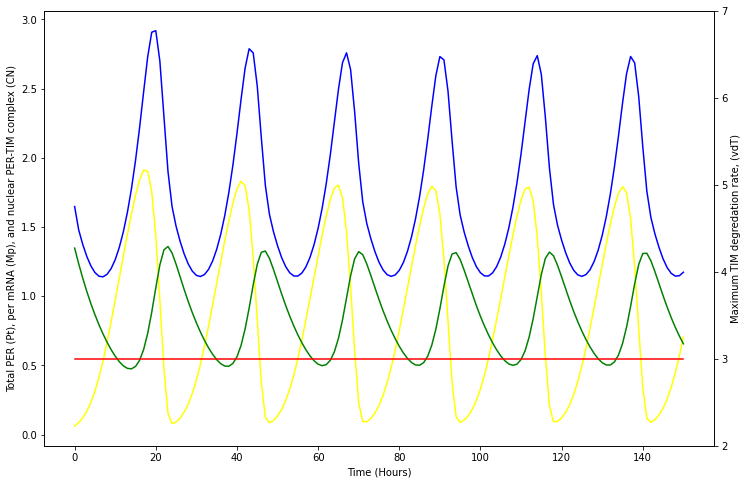
    


# Utilise a statistical tool to identify oscillation in methylation

Once again using the methylation, we will now attempt to identify regions of oscilating methylation. It should be noted that due to the fact these data only occur over 1 24 hour period, any results are not true oscilations; they only show that there was indeed a change. Further research needs to be conducted to look at the same research but over a period of > 3 days.

For this example we will specifically look at the 68-70mbp region.


```python
rhythmData = around60[(around60['chromStart'] >= 6800000) & (around60['chromStart'] <= 70000000)]
```

Filter out rows where all results are 0, as this would simply add to noise in the graph.


```python
filteredRyhthm = rhythmData[(rhythmData['ZT00'] != 0) & 
                            (rhythmData['ZT03'] != 0) & 
                            (rhythmData['ZT06'] != 0) & 
                            (rhythmData['ZT09'] != 0) &
                            (rhythmData['ZT12'] != 0) &
                            (rhythmData['ZT16'] != 0)]
```

Set the index to stop the 'chromStart' column from interferring with the calculations in the FFT.


```python
filteredRyhthm.set_index('chromStart', inplace=True)
```

This does require dropping the Unnamed: 0 column that is an artifact from the TSV file. Assign to self as this function is not inplace.


```python
filteredRyhthm = filteredRyhthm.drop(['Unnamed: 0'], axis=1)
```

This heatmap shows the change in expression across these 73 filtered results.


```python
fig, ax = plt.subplots()
ax.pcolormesh(filteredRyhthm, vmax = 1.0, vmin = 0.0)

ax.set_xlabel('Time (By time course column)')
ax.set_ylabel('Methylation site')

fig.set_size_inches(12, 8)
```


    
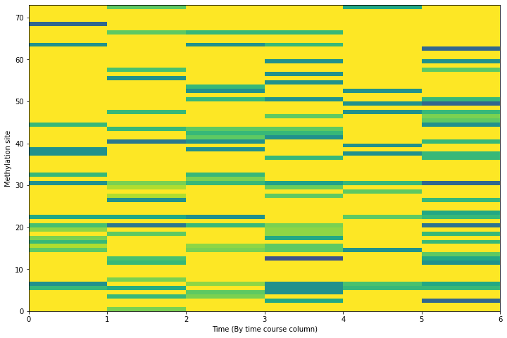
    


These data can also be plotted in the form of a line graph to show any indication of oscilation patterns across the methylated sites of the Y chromosome.


```python
fig, ax = plt.subplots(1, 1, figsize=(12, 6))
filteredRyhthm.T.plot(ax=ax, lw=.5)
ax.set_ylim(0, 1.5)
ax.set_xlabel('Time')
ax.set_ylabel('Methylation')
ax.legend(loc='right', bbox_to_anchor=(1.5, 0.5), ncol=3)

```


    <matplotlib.legend.Legend at 0x13fe55df0>


    
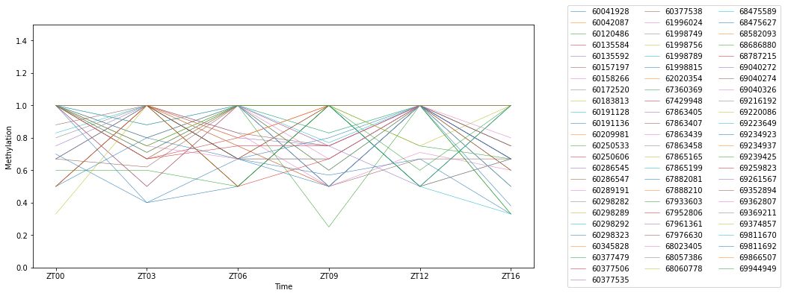
    


This clearly is not filtered enough to make any conclusion with, so we will filter for a sequence at ~68mbp. 


```python
smallerRhythm =  around60[(around60['chromStart'] >= 67900000) & (around60['chromStart'] <= 67940000)]
```


```python
smallerRhythm = smallerRhythm[(smallerRhythm['ZT00'] != 0) & 
                            (smallerRhythm['ZT03'] != 0) & 
                            (smallerRhythm['ZT06'] != 0) & 
                            (smallerRhythm['ZT09'] != 0) &
                            (smallerRhythm['ZT12'] != 0) &
                            (smallerRhythm['ZT16'] != 0)]
smallerRhythm.set_index('chromStart', inplace=True)
```


```python
smallerRhythm = smallerRhythm.drop(['Unnamed: 0'], axis=1)
smallerRhythm
```


<div>
<style scoped>
    .dataframe tbody tr th:only-of-type {
        vertical-align: middle;
    }

    .dataframe tbody tr th {
        vertical-align: top;
    }

    .dataframe thead th {
        text-align: right;
    }
</style>
<table border="1" class="dataframe">
  <thead>
    <tr style="text-align: right;">
      <th></th>
      <th>ZT00</th>
      <th>ZT03</th>
      <th>ZT06</th>
      <th>ZT09</th>
      <th>ZT12</th>
      <th>ZT16</th>
    </tr>
    <tr>
      <th>chromStart</th>
      <th></th>
      <th></th>
      <th></th>
      <th></th>
      <th></th>
      <th></th>
    </tr>
  </thead>
  <tbody>
    <tr>
      <th>67933603</th>
      <td>1.0</td>
      <td>1.0</td>
      <td>0.67</td>
      <td>0.67</td>
      <td>1.0</td>
      <td>1.0</td>
    </tr>
  </tbody>
</table>
</div>


The following graph shows that this site indeed goes through a change in methylation.


```python
fig, ax = plt.subplots(1, 1, figsize=(12, 6))
smallerRhythm.T.plot(ax=ax, lw=.5)
ax.set_ylim(0, 1.5)
ax.set_xlabel('Time')
ax.set_ylabel('Methylation')
ax.legend(loc='right', bbox_to_anchor=(1.5, 0.5))

```


    <matplotlib.legend.Legend at 0x140390b50>


    
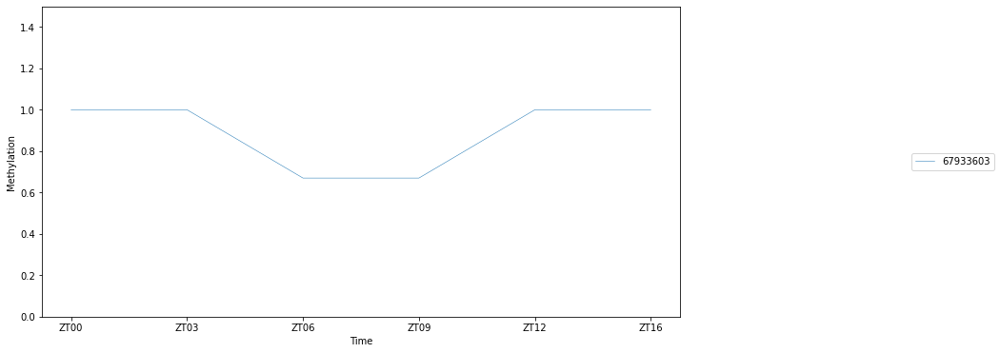
    


We can now perform a Fourier Transform and find the spectral density of the signal. First, we must import the right scipy modules.


```python
import scipy as sp
import scipy.fftpack
```

In the case of these data, the dataframe had to be transposed.


```python
smallerRhythm = smallerRhythm.T
```


```python
temp_fft = sp.fftpack.fft(smallerRhythm)
```

At this point we have the Fast Fourier Transform (FFT) values which we must square in order to get the power spectral density (PSD) values.


```python
temp_psd = np.abs(temp_fft) ** 2
```

As we have 6 time zones to account for, the time dimension needs to be divided by 6.


```python
fftfreq = sp.fftpack.fftfreq(len(temp_psd), 1/6)
```

To return positive values as the above returns negative values too, we perform:


```python
i = fftfreq > 0
```

This can now be plotted on the frequency domain.


```python
fig, ax = plt.subplots(1, 1, figsize=(8, 4))
ax.plot(fftfreq[i], 10 * np.log10(temp_psd[i]))
ax.set_xlabel('')
ax.set_ylabel('PSD (dB)')
```


    Text(0, 0.5, 'PSD (dB)')


    
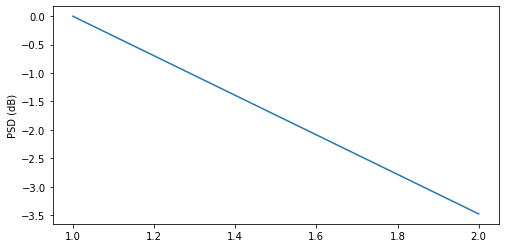
    


```python
temp_fft_bis = temp_fft.copy()
temp_fft_bis[np.abs(fftfreq) > 1.1] = 0
```

At this point an inverse FFT can be performed to apply the temporal domain back to the data. This returns a fundemental signal


```python
temp_slow = np.real(sp.fftpack.ifft(temp_fft_bis))
```


```python
fig, ax = plt.subplots(1, 1, figsize=(12, 6))
smallerRhythm.plot(ax=ax, lw=.5)
ax.plot(temp_slow, '-')
ax.set_ylim(0, 1.1)
ax.set_xlabel('Time')
ax.set_ylabel('Methylation')
ax.legend(loc='right', bbox_to_anchor=(1.5, 0.5), ncol=3)

```


    <matplotlib.legend.Legend at 0x12f375f40>


    
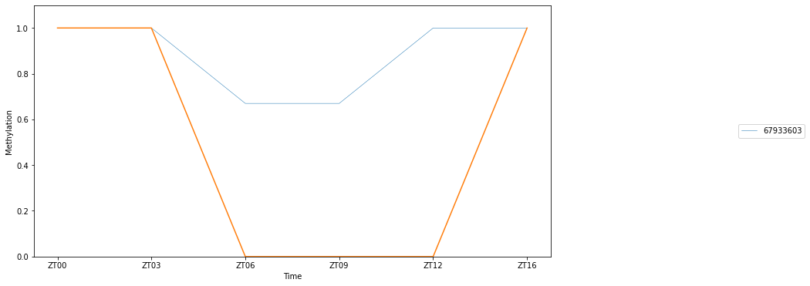
    


This plot shows that relative to the data, the change in methylation is significant across this stretch of time.


Figure 1: A graphical representation of the day/night cycle the mice were exposed to in this experiment, adapted from Figure 4a of Coulson (2018).

The above graph indicates that there could be some ocilation in the region of 67.90 mbp to 67.97 mbp of chromosome Y. The nucleotide at position 67933603 bp shows a change in the percentage of reads indicating methylation, this could be an indicator of the change in silencing of a gene over time; in this case, at the period before dark, see Figure 1 (above). The gene that this nucleotide affects is in the middle of, a transcribed yet unprocessed pseudogene, Gm29218.

# Network Graph


Here a graph which maps the presence of the CSD (complementary sex determination) gene and its ancestral FEM (feminiser) gene to the genomes of 4 Apis sp. and 5 Bombus sp. from the Hymenoptera Genome Database (https://hymenoptera.elsiklab.missouri.edu/).


```python
import networkx as nx
import pandas as pd
import matplotlib.pyplot as plt
```

Import the data output from BLASTN against:

- Apis cerana
- Apis mellifera
- Apis dorsata
- Apis florea

- Bombus bifarius (no hits in final data)
- Bombus impatiens (no hits in final data)
- Bombus terrestris
- Bombus vacouverensis
- Bombus vosnesenskii

Apis sp. were selected as the CSD gene is thought to have originated in the genus.

Bombus sp. are closely related but thought to not carry a CSD that is particularly similar to Apis. It is possible that Bombus may carry MSD (multiple sex determining regions).

Now read in the data, creating a new org column to group scaffold level hits to each assembly.


```python
dataFEM = pd.read_csv("femVsApisBombus.tsv", '\t')
dataFEM[['Org','accession']] = dataFEM['subject_id'].str.split('|', expand=True)

dataCSD = pd.read_csv("csd.tsv", '\t')
dataCSD[['Org','accession']] = dataCSD['subject_id'].str.split('|', expand=True)
```

Confirm column headers.


```python
dataFEM.columns.values
```


    array(['query_id', 'query_gi', 'query_acc', 'subject_id', 'subject_gi',
           'subject_gis', 'subject_acc', 'subject_acc.1', 'q_start', 'q_end',
           's_start', 's_end', 'query_seq', 'subject_seq', 'evalue',
           'bit_score', 'score', 'alignment_length', '%_identity',
           'identical', 'mismatches', 'positives', 'gap_opens', 'gaps',
           '%_positives', 'query/sbjct_frames', 'query_frame', 'BTOP',
           'subject_tax_ids', 'subject_sci_names', 'subject_com_names',
           'subject_blast_names', 'subject_super_kingdoms', 'subject_title',
           'subject_titles', 'subject_strand', '%_query coverage_per_subject',
           '%_query_coverage_per_hsp', 'Org', 'accession'], dtype=object)


Get counts of the data, the columns with no data would be useful to have but will not be used.


```python
print(f'FEM data: \n{dataFEM.count()}\n\nCSD data: \n{dataCSD.count()}')
```

    FEM data: 
    query_id                        7407
    query_gi                        7407
    query_acc                       7407
    subject_id                      7407
    subject_gi                      7407
    subject_gis                     7407
    subject_acc                     7407
    subject_acc.1                   7407
    q_start                         7407
    q_end                           7407
    s_start                         7407
    s_end                           7407
    query_seq                       7407
    subject_seq                     7407
    evalue                          7407
    bit_score                       7407
    score                           7407
    alignment_length                7407
    %_identity                      7407
    identical                       7407
    mismatches                      7407
    positives                       7407
    gap_opens                       7407
    gaps                            7407
    %_positives                     7407
    query/sbjct_frames              7407
    query_frame                     7407
    BTOP                            7407
    subject_tax_ids                    0
    subject_sci_names                  0
    subject_com_names                  0
    subject_blast_names                0
    subject_super_kingdoms             0
    subject_title                   7407
    subject_titles                  7407
    subject_strand                  7407
    %_query coverage_per_subject    7407
    %_query_coverage_per_hsp        7407
    Org                             7407
    accession                       7407
    dtype: int64
    
    CSD data: 
    query_id                        12613
    query_gi                        12613
    query_acc                       12613
    subject_id                      12613
    subject_gi                      12613
    subject_gis                     12613
    subject_acc                     12613
    subject_acc.1                   12613
    q_start                         12613
    q_end                           12613
    s_start                         12613
    s_end                           12613
    query_seq                       12613
    subject_seq                     12613
    evalue                          12613
    bit_score                       12613
    score                           12613
    alignment_length                12613
    %_identity                      12613
    identical                       12613
    mismatches                      12613
    positives                       12613
    gap_opens                       12613
    gaps                            12613
    %_positives                     12613
    query/sbjct_frames              12613
    query_frame                     12613
    BTOP                            12613
    subject_tax_ids                     0
    subject_sci_names                   0
    subject_com_names                   0
    subject_blast_names                 0
    subject_super_kingdoms              0
    subject_title                   12613
    subject_titles                  12613
    subject_strand                  12613
    %_query coverage_per_subject    12613
    %_query_coverage_per_hsp        12613
    Org                             12613
    accession                       12613
    dtype: int64


Filter the data for >90% identity and then filter for the first occurance of a subject species query (scaffold) with the highest % identity match. This cuts down the amount of data brought into the graph.


```python
# This first block is for a more visually impressive graph
filteredDataFem = dataFEM[(dataFEM['%_identity'] > 90.00)]
filteredDataFem = filteredDataFem.groupby('subject_acc').apply(lambda g: g[g['%_identity'] == g['%_identity'].max()])
filteredDataFem.count()

# This block is for a more realistic graph, the gene is 9.4kbp, so filtering for 2000bp would remove errorneous matches
filteredDataFem2 = dataFEM[(dataFEM['%_identity'] > 90.00) & (dataFEM['alignment_length'] > 2000)]
filteredDataFem2 = filteredDataFem2.groupby('subject_acc').apply(lambda g: g[g['%_identity'] == g['%_identity'].max()])
```


```python
# This first block is for a more visually impressive graph
filteredDataCSD = dataCSD[(dataCSD['%_identity'] > 90.00)]
filteredDataCSD = filteredDataCSD.groupby('subject_acc').apply(lambda g: g[g['%_identity'] == g['%_identity'].max()])
filteredDataCSD.count()

# This block is for a more realistic graph, the gene is 9.4kbp, so filtering for 2000bp would remove errorneous matches
filteredDataCSD2 = dataCSD[(dataCSD['%_identity'] > 90.00) & (dataCSD['alignment_length'] > 2000)]
filteredDataCSD2 = filteredDataCSD2.groupby('subject_acc').apply(lambda g: g[g['%_identity'] == g['%_identity'].max()])

```

Convert the pandas dataframe objects into graph format.


```python
Gfem = nx.from_pandas_edgelist(filteredDataFem, 'query_id', 'subject_acc')
Hfem = nx.from_pandas_edgelist(filteredDataFem, 'Org', 'subject_acc')
Gcsd = nx.from_pandas_edgelist(filteredDataCSD, 'query_id', 'subject_acc')
Hcsd = nx.from_pandas_edgelist(filteredDataCSD, 'Org', 'subject_acc')
Ffem = nx.compose(Gfem,Hfem)
Fcsd = nx.compose(Gcsd, Hcsd)
```

Graph showing the results for CSD matches.


```python
pos = nx.spring_layout(Fcsd, seed=225)
nx.draw(Fcsd, pos)
```


    
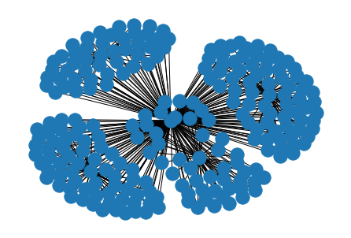
    


Graph showing the results for FEM matches.


```python
pos = nx.spring_layout(Ffem, seed=225)
nx.draw(Ffem, pos)
```


    
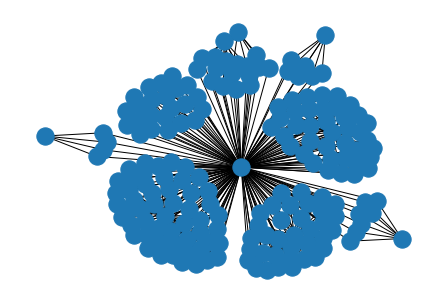
    


Now to create a graph with all data to show which species do and do not have the genes.


```python
# Rename, inplace, the base node as the gene of interest for each graph
nx.relabel_nodes(Ffem, {0:"FEM"}, copy=False)
nx.relabel_nodes(Fcsd, {0:"CSD"}, copy=False)

# Merge the two individual graphs
FF = nx.compose(Ffem, Fcsd)

# Create Label dict, for the labels we want to show.
label_dict = {}
label_dict['CSD'] = 'CSD gene'
label_dict['FEM'] = 'FEM gene'
label_dict['Amel_HAv3.1'] = 'A.mellifera'
label_dict['Apis_dorsata_1.3'] = 'A.dorsata'
label_dict['Aflo_1.1'] = 'A.florea'
label_dict['ACSNU-2.0'] = 'A.cerana'
label_dict['Bvos_JDL3184-5_v1.1'] = 'B.vosnesenskii'
label_dict['Bvanc_JDL1245'] = 'B.vancouverensis'
label_dict['Bter_1.0'] = 'B.terrestris'
label_dict['BIMP_2.2'] = 'B.impatiens'
label_dict['Bbif_JDL3187'] = 'B.bifarius'


# Generate NODE colour mapping of species
colour_map = {'CSD':'#249c02', # darker green
             'FEM':'#c5078c', # darker pink
             'Amel_HAv3.1':'#9ab503',
             'ACSNU-2.0': '#9ab503',
             'Apis_dorsata_1.3':'#9ab503',
             'Aflo_1.1' : '#9ab503',
             'Bter_1.0': '#914be2',
             'Bvanc_JDL1245': '#914be2',
             'Bvos_JDL3184-5_v1.1': '#914be2',
             'BIMP_2.2': '#914be2',
             'Bbif_JDL3187': '#914be2'
             }

node_colours = [colour_map.get(node, '#E0D91B') for node in FF.nodes()]

# Generate Edge 
edge_colours = []
for i in FF.edges():
    if i[1] == 'CSD':
        edge_colours.append('#30d303') # light green
    elif i[1] == 'FEM':
        edge_colours.append('#eb00a4') # pink
    elif i[1].startswith('A'):
        edge_colours.append('#c5e704')
    else:
        # At this point only Bombus are left for assignment
        edge_colours.append('#9c7cee')

# Modify positions of key nodes to clean up the graph
pos = nx.spring_layout(FF, seed=100, weight='w')

pos2 = {}
for i, y in pos.items():
    if i == 'CSD':
        pos2[i] = np.array([0.65, 0.65])
    elif i == 'FEM':
        pos2[i] = np.array([-0.55, -0.55])
    elif i.startswith('Amel_HAv3.1'):
        pos2[i] = np.array([y[0]-0.1, y[1]])
    elif i.startswith('ACSNU-2.0'):
        pos2[i] = np.array([y[0], y[1]-1])
    elif i.startswith('Aflo_1.1'):
        pos2[i] = np.array([y[0], y[1]+1])
    elif i.startswith('Apis_dorsata_1.3'):
        pos2[i] = np.array([y[0] + 0.4, y[1]-0.4])
    elif i.startswith('Bbif'):
        pos2[i] = np.array([y[0], y[1]-0.4])
    else:
        pos2[i] = y

# Plot with matplotlib in order to change size of the plot
plt.figure(1, figsize=(12,6))

nx.draw(FF, pos2, node_color = node_colours, edge_color = edge_colours, labels = label_dict, with_labels=True)

plt.show()

```


    

    


Purple = Bombus sp. and conenctions to Bombus sp. scaffolds.
Mustard = Apis sp. and conenctions to Apis sp. scaffolds.
Yellow = Scaffolds of connected species.
Pink = FEM gene and its connections to scaffolds.
Green = CSD gene and connections to scaffolds

The above representation is what would be expected in a broad overview, the CSD gene arose through neofunctional duplication of the FEM gene which is ancestral in hymenopterans. 

Only some scaffolds contain one/the other or both genes (many of these are false positive). In order to declutter the graph we can use the further filtered data produced above.


```python
Gfem2 = nx.from_pandas_edgelist(filteredDataFem2, 'query_id', 'subject_acc')
Hfem2 = nx.from_pandas_edgelist(filteredDataFem2, 'Org', 'subject_acc')
Gcsd2 = nx.from_pandas_edgelist(filteredDataCSD2, 'query_id', 'subject_acc')
Hcsd2 = nx.from_pandas_edgelist(filteredDataCSD2, 'Org', 'subject_acc')
Ffem2 = nx.compose(Gfem2,Hfem2)
Fcsd2 = nx.compose(Gcsd2, Hcsd2)

nx.relabel_nodes(Ffem2, {0:"FEM"}, copy=False)
nx.relabel_nodes(Fcsd2, {0:"CSD"}, copy=False)

FF = nx.compose(Ffem2, Fcsd2)

label_dict = {}
label_dict['CSD'] = 'CSD gene'
label_dict['FEM'] = 'FEM gene'
label_dict['Amel_HAv3.1'] = 'A.mellifera'

colour_map = {'CSD':'#249c02', # darker green
             'FEM':'#c5078c', # darker pink
             'Amel_HAv3.1':'#9ab503'}

node_colours = [colour_map.get(node, '#E0D91B') for node in FF.nodes()]

plt.figure(1, figsize=(12,6))

nx.draw(FF, labels = label_dict, node_color = node_colours)

plt.show()
```


    
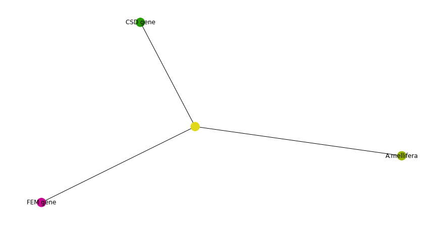
    


At this point no further configuration needs to occur, both the FEM and CSD genes are highly divergent to the point where they can only be found in specific algorithmic searches. In fact, the FEM for B.terrestrics is 1.5x longer than that from A.mellifera, which complicates any comparative genomics (their comparison can be seen here: https://metazoa.ensembl.org/Apis_mellifera/Location/Compara_Alignments/Image?g=GeneID_724970;otherspecies=Bombus_terrestris;r=CM009933.2:11765136-11796509;t=NM_001134828;align=9732;db=core). The two used in this example are derived from A.mellifera which explains why they were found.

The above graph also shows that both genes were identified on the same scaffold, which would be the case as they are downstream from each other on chromosome 2 of A.mellifera.

# References

Coulson, RL., Yasui, DH., Dunaway, KW., Leufer, BI., Ciernia, AV., Zhu, Y., Mordaunt, CE., Totah, TS., LaSalle, JM. 2018. Snord116-dependent diurnal rhythm of DNA methylation in mouse cortex. _Nature Communications_ [e-journal]. 9(1). pp. 1616. DOI: 10.1038/s41467-018-03676-0.

Bertozzi, AL., Franco, E., Mohler, G., Short, MB., Sledge, D. 2020. The challenges of modeling and forecasting the spread of COVID-19. _Proc Natl Acad Sci U S A_ [e-journal]. 117(29). pp.16732-16738. doi: 10.1073/pnas.2006520117.

Leloup, JC., Gonze, D., Goldbeter, A. 1999. Limit cycle models for circadian rhythms based on transcriptional regulation in Drosophila and Neurospora. _Journal of Biological Rhythms_ [e-journal]. 14(6). pp.433-448. doi: 10.1177/074873099129000948.


```python

```
