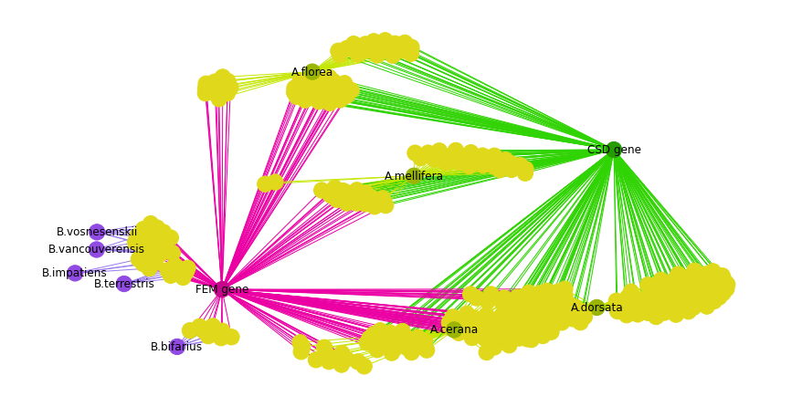

# Advanced Programming for Systems Biology and Visualisation

This repo contains the files used in completing the coursework component of APSB.

Repo Structure:

- 1836811-APSB coursework.pdf - Coursework file in PDF.
- 1836811-APSB coursework.html - Coursework file in HTML.
- 1836811-APSB coursework.ipynb - Coursework file - This has been run in VisualStudio.
- bertozzi_model.py - Model from BioModels
- leloup_model.py - Model from BioModels

- data_model
  - The XML model files downloaded from BioModels (26th July 2022).

- data_networkx
  - Two FASTA files used as input to BLASTN.
  - Two TSV summerising the data taken from BLASTN and used in producing the networkx graphs.

- MarkdownCoursework
  - Due to errors with converting to PDF, a markdown copy of the coursework has been included
  - 16 png images for the graphs produced.

Above is a graph produced using networkx for this coursework. It shows the scaffolds of 9 bees (Bombus sp. and Apis sp. )

## Change Log

###  30@27-07-2022

BioModels website has crashed and notes added to the IPYNB to alert the user.

###  30@28-07-2022

- BioModels website is still down.

- Removed TSV dumps to local files for end user assessment, due to the size of these files it wasn't possible.

### 31@01-08-2022

- BioModels is back up, modifying coursework to reflect it.

- Added HTML copy of coursework - better than the PDF.
